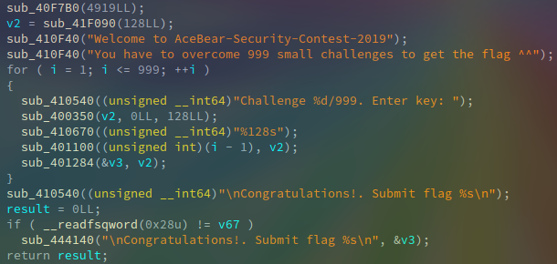
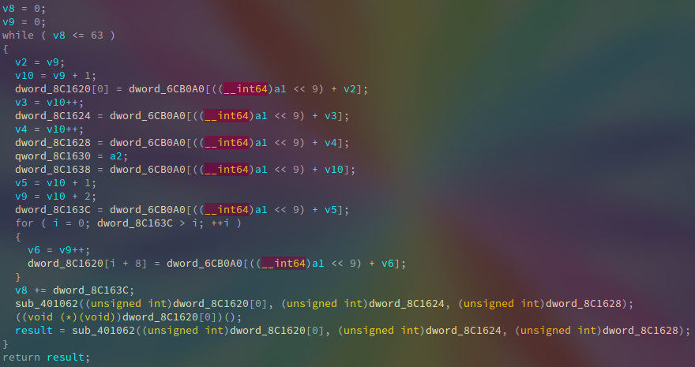

> [Challenge link](https://github.com/ks75vll/ctf/tree/master/2019/AceBear/re/999)

Đề bài cho ta một file thực thi có định dạng ELF, sau khi load vào IDA và mình xem qua các hàm và rename chúng theo chức năng, tất nhiên có thể không đúng hoàn toàn nhưng cơ bản nó vẫn nói lên chức năng của hàm đó. Bên dưới là hàm **main** (sub_4012D7):

Chúng ta sẽ phải input lần lượt 999 key, key sau khi input sẽ được đưa vào hàm **f_check** (sub_401100), nếu thỏa mãn thì flag sẽ được XOR với key, ngược lại thì chương trình sẽ exit ngay trong hàm **f_check**.

Hàm **f_check**:

`unk_6CB0A0` là một mảng số nguyên có cấu trúc như sau:

- Address: địa chỉ của 1 hàm
- size: kích thước của hàm (bytes)
- key: key để decrypt hàm bằng phép toán xor
- index: vị trí của key được xử lý (input key)
- n: số phần tử của key được xử lý, bắt đầu từ index

Mỗi key sẽ được xử lý 64 lần, mỗi lần sẽ được xử lý bởi các hàm khác nhau, vị trí xử lý trên key khác nhau, số phần tử trên key khác nhau, đối số cho hàm xử lý khác nhau. Tất các các thông số trên đều được lưu trong `unk_6CB0A0` theo cấu trúc trên.

Do các hàm xử lý được mã hóa bằng toán tử xor, nên IDA sẽ không decompile chính xác được, chúng ta sẽ dựa vào mảng **unk_6CB0A0** để patch các hàm xử lý:

> [patch.py](https://github.com/ks75vll/ctf/blob/master/2019/AceBear/re/999/patch.py)

Sau khi patch thì ta thấy có tất cả 7 hàm check, 7 hàm này khá ngắn, ta có thể reverse để tìm key hợp lệ.
Trong các hàm xử lý thì có 1 hàm không thể reverse được (**sub_400eb5**), vì với 1 giá trị của output ta có thể tìm được nhiều giá trị input hợp lệ.
Điều này dẫn đến có thể ta tìm được 999 key thỏa mãn 7 hàm check kia, nhưng ta không thể tìm được flag, vì flag được XOR với 999 key.
Đến đây thì mình liên hệ với AceBear team, được họ giúp đỡ và đã lấy được flag.

> [script.py](https://github.com/ks75vll/ctf/blob/master/2019/AceBear/re/999/script.py)

Flag: `AceBear{<3SimpleExpressionsWillBecomeDifficultInThisChallengeE>}`
