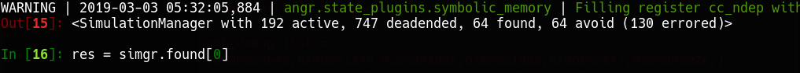

== AngrControlFlow - Naive binary

You can grab the challenges at https://github.com/cothan/ctfwriteups/blob/master/umbc/re/angrycontrolflow[here]. 

A small note while reversing large binaries, when you look at any graph, look from the bottom up, it gives you some senses where the flow goes. From the end first, and then up to where it starts.

When a crypto guy looks at the graph, 2 things are going on in his head:

* Non-constant time comparison, vulnerable to timing attack.
* Simple comparison. Easy to reverse. 

Let me remind you once again, what can be solved with Z3 can be solved with Angr, because Angr uses Z3 as the internal symbolic solver, however, we often don't deal with Z3 in Angr, we use Claripy as an abstract symbolic layer.

The more I use Angr, I realize Claripy has more capabilities tailored to reverse engineering in BitVector field than mathematical aspects like Z3. By saying this, I mean the performance gain is nothing, but the ease of implementation is quite comfortable. (I use Z3 longer enough so both are good for me)

About the binaries:

* No anti-debug (if it has, I would patch it, in the later of this post, I will introduce to hook anti-debug instead of patching)
* No SIMD instruction

So here is my plan to solve the challenge:

* Decompiled the code by IDA, solve it with Z3 (the last resort)
* Apply automate binary analysis Angr
* Intel Pintool to count instructions, if we pass a comparison check, the number of instruction we execute is increased, so we can solve this with Pintool. However, because the comparison uses non-consecutive array, so we have to customize Pintool. 

Let's go with Angr first. If we can't make it, we will be back to Z3.

As usual, we load the binary, let it run at `main()`, define a good point and bad point, and pray Angr gets to the winning branch. 

[source, python]
----
import angr

p = angr.Project('angrycontrolflow')

In [5]: p = angr.Project('angrycontrolflow')
WARNING | 2019-03-03 02:39:04,834 | cle.loader | The main binary is a position-independent executable. It is being loaded with a base address of 0x400000.

----

Oops, this time the binaries is position-independent code (PIC). It's not like what we used to do. However, the binary is load with a base address *0x400000*. We note that, and move on.

This time, we write like what we used to do. Find a good point, bad point, and hint the simulation manager (`simgr`) to get to a good point and avoid a bad point 

[source,python]
----
main = 0x000007e4

state = p.factory.entry_state(addr=main)

simgr = p.factory.simulation_manager(state)

good =0xa66
bad = 0xa88

simgr.explore(find=good, avoid=bad)
----

Oh man, we get errors.

This happens because God doesn't like you, or you don't treat people well so the drama goes back to you, or it could be because you use a Mac.  

The real reason is, we pin the function address to a specific address, that address number is way too low, so we may think what we did is unusual. It's true when Angr is started, it starts at the main function, which is a non-exist location in the binary code. As a result, when simgr runs, it starts from nowhere and ends at nowhere, that is why it doesn't work.

So I gave you a hint before when we load the binary, the base address is 0x400000, now let's modify the code, add the base address to these addresses we proposed. 

[source, python]
----
base = 0x400000
main = base + 0x000007e4

state = p.factory.entry_state(addr=main)

simgr = p.factory.simulation_manager(state)

good = base + 0xa66
bad = base + 0xa88

simgr.explore(find=good, avoid=bad)
----

Wow, we found the result.

Let dump the result out. 

[source, python]
----
result = simgr.found[0]

# Always print this 
for i in range(3):
    print (result.posix.dumps(i))
----

Yay we have the flag.

The whole script here:

[source, python]
----
import angr 

p = angr.Project('angrycontrolflow')

base = 0x400000
main = base + 0x000007e4

state = p.factory.entry_state(addr=main)

simgr = p.factory.simulation_manager(state)

good = base + 0xa66
bad = base + 0xa88

simgr.explore(find=good, avoid=bad)

result = simgr.found[0]

# Always print this 
for i in range(3):
    print (result.posix.dumps(i))
----

== ReMe - Antidebug

Not long ago I wrote a challenge Introduction to SMT in Efiens Round 2 CTF. You can see the writeup here. The download link also in https://github.com/LKMDang/EfiensCTF_Round2/tree/master/RE_SMT[midas's github]. 

image::reme.gif[Wow, this time multiple comparisons but not many branches. `afgw reme.gif`]

The code is developed by me, therefore if you take a look at the comparison graph, it's not vulnerable to timing attack.

Let's go with Angr, midas's solution is in Z3, from what I said, what can be complete with Z3 can be complete in Angr.

Check the binary:

* There are anti-debug functions, we will hook to the address of anti-debug function and replace it to do nothing, and functions with fork, we modify the `eax` register to avoid it jump to a black hole
* The code is PIC (so we need to add base)
* Patch the obfuscated code which takes forever to complete in the beginning (using radare2). We patch at address` 0x00000bb6  jmp 0xc01` to `jmp 0xc0a`

As usual, let's start loading the binary and read the base given to us. 

[source, python]
----
import angr 

p = angr.Project('REme-a28b7273a8e6671e6f0a361addbba87e')

WARNING | 2019-03-03 03:43:33,089 | cle.loader | The main binary is a position-independent executable. It is being loaded with a base address of 0x400000.
----

As always, we start at main, start simulation manager, find good points and bad points. Remember, this binary has base `0x400000`, so we should add the base to address in order to make Angr work. 

[source, python]
----
base = 0x400000
main = base + 0x00000b2f 

state = p.factory.entry_state(addr=main)

simgr = p.factory.simulation_manager(state)

good = base + 0x38ec
bad = base + 0x38ff
----

In the previous blog post about Angr, I write a hook function as this style

[source, python]
----
@p.hook(0x123)
def bla(state):
  pass
----

But we could write it shorter, like this, both will work in the same way 

[source, python]
----
def bla(state):
  pass

p.hook(addr=0x123, bla)
----

The input to hook function is `state`, you may ask why, because when Angr run to the address we specify to hook, it will pass the current state it has to the hook function and ask "What do you want to do with this state? You asked for a hook". That's why we need to pass state to hook. 
Otherwise, we get errors and Angr will exit.

Next step, instead of patching a bunch of places, I decided to hook the `ptrace` to do `nothing` and `fork` function to set `eax=1`. 

[source, python]
----
def nothing(sate):
    pass 

def set_eax(state):
    state.regs.eax = 1 
----

Alright, back to our script, now we see that `ptrace` has `XREF` as address `0x341f`, so let's hook it with `nothing()` . And hook `fork` with `set_eax()`

[source, python]
----
ptrace = base+ 0x341f

p.hook(ptrace, nothing)

gdb_debug_list = [0x00000b4e,0x00001340,0x00001805,0x00001dd3,0x000026ff,0x0000302e,]
gdb_debug_list = map(lambda x: base+x, gdb_debug_list)

for addr in gdb_debug_list:
    p.hook(addr, set_eax)
----

Alright, let's the simulation manager  find its way to the good points.

[source, python]
----
simgr.explore(find=good,avoid=bad)
----

Nice, there are 64 solutions to good points. Let's grab it. 

Here is the full script for you to grab and play

[source, python]
----
import angr 

def nothing(sate):
    pass 

def set_eax(state):
    state.regs.eax = 1 
    pass

p = angr.Project('REme-a28b7273a8e6671e6f0a361addbba87e')

base = 0x400000
main = base + 0x00000b2f 

state = p.factory.entry_state(addr=main)

simgr = p.factory.simulation_manager(state)

good = base + 0x38ec
bad = base + 0x38ff

ptrace = base+ 0x341f

p.hook(ptrace, nothing)

gdb_debug_list = [0x00000b4e,0x00001340,0x00001805,0x00001dd3,0x000026ff,0x0000302e,]
gdb_debug_list = map(lambda x: base+x, gdb_debug_list)

for addr in gdb_debug_list:
    p.hook(addr, set_eax)

simgr.explore(find=good,avoid=bad)

result = simgr.found[0]

# Always print this 
for i in range(3):
    print (result.posix.dumps(i))
----

Well, you reach the end of this post and wonder why we have to deal with Angr instead of Z3 in order to solve ReMe? In terms of mentality, use Z3 in `ReMe` challenge is better, since I wrote it in a way to prevent Angr, I add a lot of anti-debug.

In the challenge AngrControlFlow, no anti-debug, so it would be faster to solve with Angr.

I solved AngrControlFlow with Angr within 10 mins, meanwhile, I solved my ReMe take 25 minutes.

Base on how fast I parse decompiled code from IDA, in someway, if I do `ReMe` with Z3 it would be faster. However, the solution I wrote would be only use for `ReMe` challenge, but with Angr, you can reuse your solution for another challenge.

So far, we learn how to use Angr, deal with anti-debug function, add constraints to symbolic solver, with PIC binary we need to add base.

Next time, we will try to unpack self-obfuscated binary with Angr. 