# EOSGame

Mới nhìn vào tên bài, cảm thấy khá hốt hoảng vì nghĩ rằng nay đã có CTF cho smart contract của EOS rồi à. Ơ nhưng không, vẫn chỉ là Ethereum thôi.

Đề bài cho như sau:

> Have you ever played eos.win? It’s quite easy to get eos tokens here! Submite the base64 code of your email address to the CaptureTheFlag(string b64email) fucntion when you have enough EOS. This contract is at 0x804d8B0f43C57b5Ba940c1d1132d03f1da83631F in Ropsten network.
> https://ropsten.etherscan.io/address/0x804d8b0f43c57b5ba940c1d1132d03f1da83631f#code

Source code của bài này khá đơn giản. Về cơ bản, contract EOSGame một trò cá cược giữa mình với contract. Cứ mỗi lần mình đặt cược, contract sinh ra hai số ngẫu nhiên nhỏ hơn MOD_NUM = 20. Nếu hai số này bằng nhau thì mình ăn được tiền. Mục tiêu của chúng ta là làm sao có số lượng EOS của người khởi tạo transaction tx.origin > 18888 là được

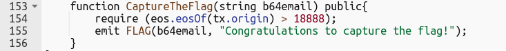

Thế lấy EOS ở đâu ra?

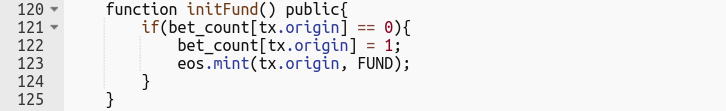

Từ các hàm:
- initFund(): hàm này gọi được một lần thôi, và contract cho mình 100 EOS lấy thảo
- smallBlind(): cược 1 đồng, thắng thì được +100
- bigBlind(): cược 20 đồng, thắng thì được +2000

Vậy, bỏ 100 đồng contract cho, mỗi lần trúng, ta có được tối đa (2000 - 20) = 1800 EOS.

Quay lại yêu cầu đề bài, chúng ta cần tối thiểu 18888 đồng thì mới có được flag. Nếu ngồi bấm bigBlind()liên tục thì không biết khi nào mới xong. Trúng thì được thêm 1800, thua thì mất 20. Xác suất ăn được tiền mỗi lần chơi là 1/20. Hết tiền thì nghỉ, hết chơi.

**Làm thế nào để hễ đã bet là ăn được tiền?**

Cùng xem lại hàm bet() của contract.

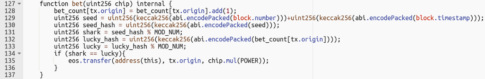

shark được tính từ block.number và block.timestamp
lucky được tính từ bet_count[tx.origin]

Trong đó, bet_count chính là số lần mình đã thực hiện đặt cược

Để khai thác được hàm này, cần lưu ý một điểm rất quan trọng, đến thời điểm này không thể sinh được số ngẫu nhiên [1] trên Ethereum smart contract.

Việc cần làm lúc này, chúng ta sẽ tạo một hợp đồng khác, và sinh ra hai số ngẫu nhiên với cách làm y hệt hàm bet(). Vì hai function này sẽ lấy cùng một giá trị block.number và block.timestamp, nên cả hai function đều cho ra cùng kết quả. Nếu hai số này giống nhau, thì mới thực hiện gọi đến bet() trong EOSGame để ăn tiền; nếu không, ta không gọi để khỏi mất 20 đồng phí cược.

Mã nguồn của contract tấn công được trình bày ở dưới.

Đến lúc này, trên thực tế, chỉ cần kiên nhẫn ngồi nhấn nút attack đỏ đỏ ở dưới góc kia cho đến khi đủ tiền là được. Tuy nhiên, mình phải ngồi đợi transaction chạy xong (khoảng 15s - tương ứng với thời gian của một block được mined), rồi mới được nhấn tiếp (có như thế thì block.number mới thay đổi). Vì mình khá là lười, nên mình viết script (ở dưới) bằng Web3 để nó tự gửi cho lành.

Khi có đủ tiền, mình chỉ cần gọi hàm CaptureTheFlag với param là base64 của email là có được flag gửi về.

`BCTF{y0u_c4n_PlAy_r34L_e0S_D0t_w1n_n0W}`

# Fake3D

*Hắn vừa làm vừa chửi. Bao giờ cũng thế, cứ làm không xong là hắn chửi.*

Ta cùng xem qua đề bài
> Welcome to fake3D game! There are airdrops for you, but you have to pass the turning test first! Flag is cheaper here, and also sent to your email. This game is at 0x4082cC8839242Ff5ee9c67f6D05C4e497f63361a in Ropsten network.
> https://ropsten.etherscan.io/address/0x4082cc8839242ff5ee9c67f6d05c4e497f63361a#code

Vừa đọc tên bài mình nghĩ ngay đến vụ tấn công của Fomo3D [2]. Nhìn vào source code thì thấy đúng là như vậy. Lúc đó mình đã nghĩ, kiểu này chắc first blood bài này rồi.

Về cơ bản, bài này cũng khai thác ở vấn đề sinh số ngẫu nhiên trên hợp đồng thông minh, thông qua hàm airDrop().

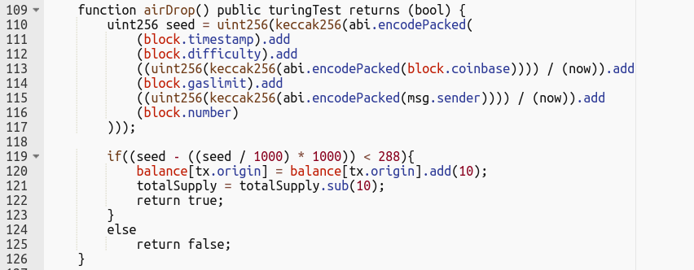

Cứ mỗi lần gọi đến, nếu kết quả của phép toán bla blah (ở dòng 119) thỏa mãn, thì chúng ta sẽ có thêm 10 đồng; nếu không thì chẳng bị làm sao (ngoài chuyện tốn transaction fee). Mục tiêu là ta gọi được hàm CaptureTheFlag() khi có hơn 8888 đồng.

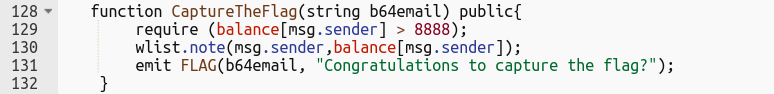

Để có được 8888 đồng thì phải cần ít nhất 888 lần gọi * 15s = gần 4 tiếng đồng hồ mới xong. Nên mình tìm cách khác để tăng số lần gọi cùng lúc lên, bằng cách dùng một contract khác để hỗ trợ.

Tuy nhiên, một điểm khác ở bài này so với bài trước đó là hàm airDrop() có một modifier turingTest (dòng 109) để chặn một contract khác call đến hàm này.

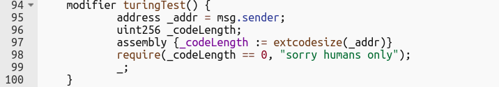

Nhìn lại ở bài trước, mình đã sử dụng một contract khác để tấn công vào contract chính. Có vẻ mình không thể replay lại cách cũ.

Tuy nhiên, modifier này cũng có vấn đề [3], vì nó chặn transaction từ hợp đồng bằng cách so extcodesize của người gửi transaction msg.sender với 0. Vì trên Ethereum, trong quá trình construction của contract, thì phần bytecode của nó vẫn chưa được sử dụng. Đồng nghĩa với, trong quá trình constructor của contract đang chạy, ta có thể call đến một contract khác, trong khi, extcodesize vẫn trả về 0. Lúc này, mình chỉ việc đặt toàn bộ việc tính trước airDrop và hàm call vào trong constructor của contract Hack mới.

> https://gist.github.com/mrssource/5fd16ced4f4f95cc494972cab14820c6

Tiếp tục, mình dùng một contract HackFactory để sinh ra nhiều contract Hack trong cùng một transaction.

Việc còn lại, mình viết một script để tự động deploy HackFactory và hốt tiền về.

Ở bước này, bạn minhtt có một cách thông minh hơn, là đặt một dòng for vào trong constructor để gọi liên tục đến airDrop() là được. Không hiểu sao mình lại không làm như thế? :|

Việc bây giờ chỉ cần submit email vào nữa là xong, nhưng đời không như mơ :)

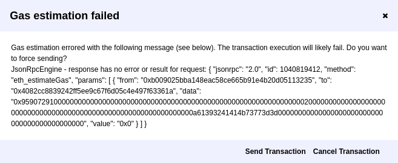

WTF lỗi?

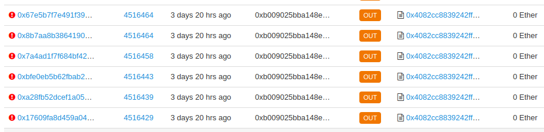

Và một đống spam để claim flag của mình nhưng đều bị revert :)

Lúc này mình quay sang lục lại transaction của các đội giải được, xem có thủ thuật gì bá đạo không, và đều nhận thấy, các team này đều gửi một lượng token sang một address khác, rồi sau đó mới claim flag.

Địa chỉ mà team L nằm ở [đây](https://ropsten.etherscan.io/address/0x26802a5966d3be5b7b8f3266ee7a3ac179fab110).

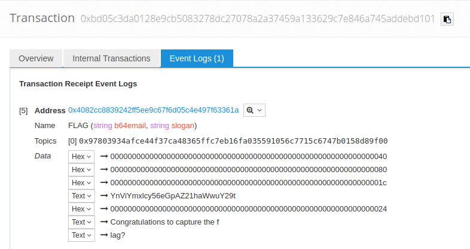

Transaction tạo ra event claim flag không có gì đăc biệt

Mình cũng bắt chước y hệt mà vẫn fail như trước :)

Vậy giờ làm gì đây? Đọc lại source.

Lúc đọc lại source, mình mới để ý là trong source code trên etherscan không chỉ có một contract. Lưu ý, bản thân Ethereum không lưu lại bất kì source code của contract nào. Source mà bạn thấy trong hình có được bằng cách (1) dev của contract gửi source code cho etherscan, sau đó (2) etherscan sẽ recompile lại contract vừa được gửi, và cuối cùng (3) so sánh bytecode của contract có trong blockchain và bytecode vừa được compile. Nếu hai bytecode này giống nhau, thì Etherscan sẽ báo đây là Verified sourcecode (xem hình).

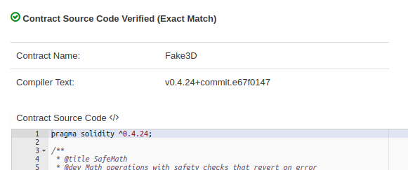

Một điểm cần lưu ý khác, chỉ tồn tại một contract được deploy tại mỗi một address. Cho nên, contract WinnerList sẽ nằm ở một địa chỉ khác.

**Làm sao để tìm được địa chỉ đó của WinnerList?** Xem ngay trên etherscan ở hàm constructor (hàm gọi lệnh tạo WinnerList tương ứng). Và đây

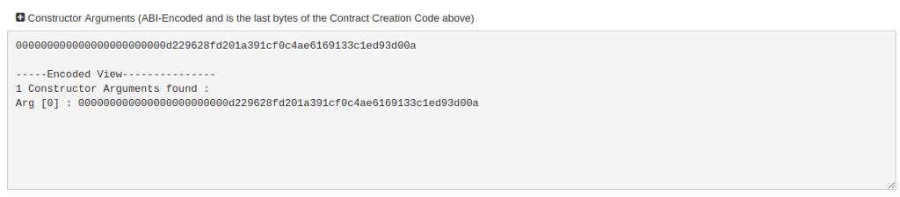

Đến đây, mình recompile lại contract với source trên etherscan và thử verify với bytecode của địa chỉ trên, thì được báo là unmatched. Đồng nghĩa với việc, source code trên etherscan đã bị mất đi một đoạn.

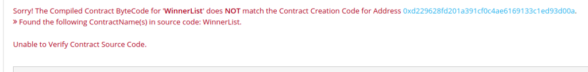

**Vậy giờ làm thế nào để RE lại hàm này đây?** Ez Ez… https://ethervm.io/decompile

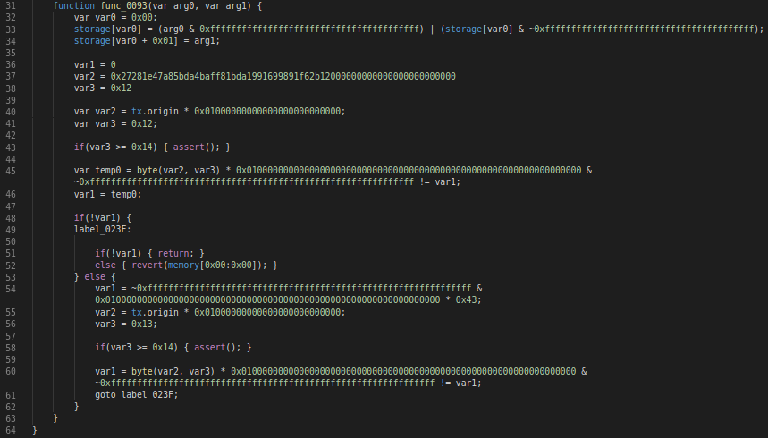

Sau một hồi đọc code, mình nhận thấy sẽ có một hàm kiểm tra (nhìn hình trên đó đó) những địa chỉ được phép claim flag. Địa chỉ này phải thoả mãn address[-2] != 0xb1 và address [-1] == 0x43 . Mình chỉ cần ngồi tạo account cho đến khi có đuôi là 43 thì thôi. Sau đó, chuyển toàn bộ token đang có về address này.

Cuối cùng, claim flag, mình được `BCTF{0nLy_b143_A66re33_c4N_b3at_f4ke3D}`

# Tham khảo
- [1] https://blog.positive.com/predicting-random-numbers-in-ethereum-smart-contracts-e5358c6b8620
- [2] https://medium.com/coinmonks/how-the-winner-got-fomo3d-prize-a-detailed-explanation-b30a69b7813f
- [3] https://consensys.github.io/smart-contract-best-practices/recommendations/#avoid-using-extcodesize-to-check-for-externally-owned-accounts
