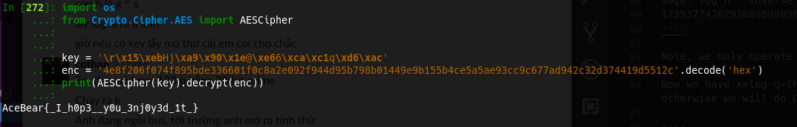

== ACEBEAR CTF 2019 - Cotan 

=== Challenge

link:cotan.pdf[Challenge description] and link:cotan.py[script] can be download link:cotan.rar[here].  

=== Solution

With some background math transform, @196 is able to convert the base to traditional DLP problem

----
p = 1361129467683753853853498429727072846149
g = 937857192022401732022326285294515252367
h = 71727917161216204087973385053390831556
----

Let's factor order of the group `p`:

----
sage: factor(p-1)
2^2 * 340282366920938463463374607431768211537
----

We call the sub-order of the group is `ell`, so we have:

- ell_small = 2
- ell_big = 340282366920938463463374607431768211537

== Calculate DLP

Using CADO-NFS with two parameters like this:

----
./cado-nfs.py -dlp -ell ell_big target=h p -t 6
----

- `-dlp`: mean we calculate Discrete Log
- `-ell`: we input the subgroup order
- `target=h p`: we set target to value `h`, modulo `p`, which mean $2^x = h$ `mod p`
- `-t 6`: run on 6 cores

NOTE: We don't specify the base here because we will have to calculate the base by ourselves

.Calculate $log_2h$
----
./cado-nfs.py -dlp -ell 340282366920938463463374607431768211537 target=71727917161216204087973385053390831556 1361129467683753853853498429727072846149 -t 6
----

.Output $log_2h$
----
Info:root:   p = 1361129467683753853853498429727072846149
Info:root:   ell = 340282366920938463463374607431768211537
Info:root:   log2 = 171268190177498693892391393563437542649
Info:root:   log3 = 83622131975737922567870551344538854285
Info:root: Also check log(target) vs log(2) ...
Info:root: target = 71727917161216204087973385053390831556
Info:root: log(target) = 306425041562113865430846743034062879086
306425041562113865430846743034062879086
----

So we have `log_h = 306425041562113865430846743034062879086`

.Calculate $log_2g$
----
./cado-nfs.py -dlp -ell 340282366920938463463374607431768211537 target=937857192022401732022326285294515252367 1361129467683753853853498429727072846149 -t 6
----

.Output $log_2g$
----
Info:root:   p = 1361129467683753853853498429727072846149
Info:root:   ell = 340282366920938463463374607431768211537
Info:root:   log2 = 171268190177498693892391393563437542649
Info:root:   log3 = 83622131975737922567870551344538854285
Info:root: Also check log(target) vs log(2) ...
Info:root: target = 937857192022401732022326285294515252367
Info:root: log(target) = 288756149835421404704013074339152764728
288756149835421404704013074339152764728
----

And we have `log_g = 288756149835421404704013074339152764728`

Like classical logarithm algorithm, to have to logarithm base `g`, which mean we are going to find $log_gh$  we do: $log(g)/log(h)$

----
sage: log_h * inverse_mod(log_g, ell) % ell 
17393774282928096980960357108851791532
----

NOTE: we only operate on `x modulo ell`, not `x modulo (p-1)` as we thought.

Now we have $x=log_g(h)$, next, we check if $g^x = h$ `mod p` or not, if it is then problem solved, otherwise we will do Chinese Reminder Theorem to figure out the full `x modulo (p-1)`. 

----
sage: p = 1361129467683753853853498429727072846149
....: g = 937857192022401732022326285294515252367
....: h = 71727917161216204087973385053390831556
....: 
sage: log_h = 306425041562113865430846743034062879086
sage: log_g = 288756149835421404704013074339152764728
sage: x = log_h * inverse_mod(log_g, ell) % ell 
sage: power_mod(g, x, p) 
71727917161216204087973385053390831556
sage: h
71727917161216204087973385053390831556
sage: assert power_mod(g, x, p) == h 

----

Alright, seem like the solution is `x = 17393774282928096980960357108851791532`. 

Now we are going to decrypt the flag 

----
from pwn import * 
from Crypto.Cipher.AES import AESCipher

x = 17393774282928096980960357108851791532
x = hex(x).lstrip('0x')
key = unhex(x).decode('hex')
enc = '4e8f206f074f895bde336601f0c8a2e092f944d95b798b01449e9b155b4ce5a5ae93cc9c677ad942c32d374419d5512c'.decode('hex')
print(AESCipher(key).decrypt(enc))
---- 

And the flag is `AceBear{_I_h0p3__y0u_3nj0y3d_1t_}`

