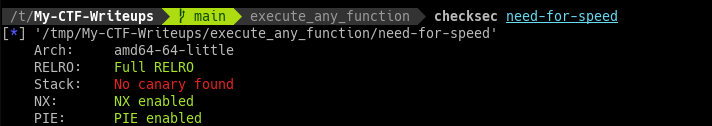
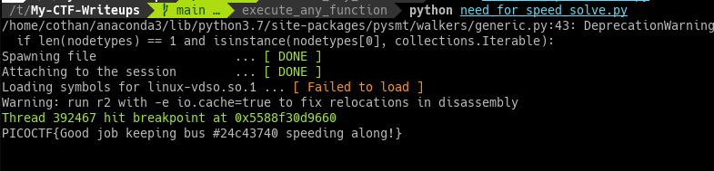
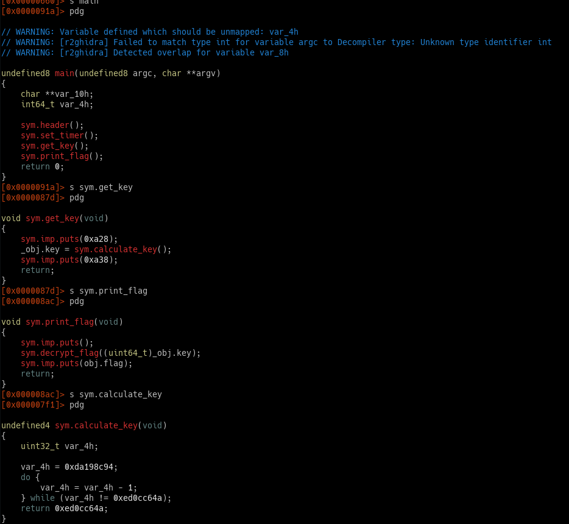
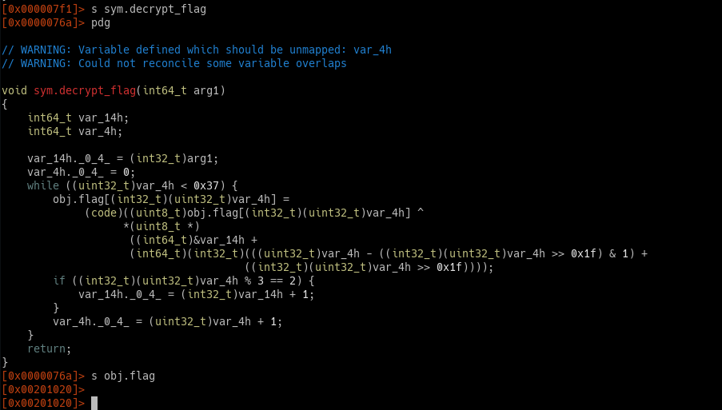

== Execute an arbitrary function in any binary

This tutorial shows you how to execute functions in any binary. So you don't have to use `ctypes.CDLL`

https://github.com/bannsec/revenge[Take a look at REVerse ENGineering Environment (revenge)]

Recently I get into a problem that I want to execute a function in a binary. The binary I'm analyzing is a fucked up binary, the header and the main function is corrupted, but some functions are executable. So there is a little chance for me to debug the binary or run it from the entry point.

So I have a few options:

* Copy instructions, emulate them
* Copy instruction by rewriting it. I can easily fail in 2 language problems. For example, I prefer to write code in Python, but how can I translate SAR(Arithmetic Shift) in ASM to Python? No, I want it quick.
* Try to execute it by manipulating Instruction Pointer (EIP/RIP)

Time after time I keep running into this problem, once, I use `ctypes.DLL` to get `rand` number, but that binary I was working with have custom rand so I can't call the alternative rand in `libc`.

Life is so boring to repeatedly do the same thing over and over again.

Recently I found a framework write on top of `Frida`, I can run on any environment as long as you can execute the binary, (ARM, Linux, Windows), so that a good thing. Imagine you're trying to reverse a check_password in ARM router, so you can just use a Raspberry Pi as environment and brute the password. No re-write needed.

Wanna see how effective this method is ?

First, I give you a binary.

This binary is taken from PicoCTF training platform.

Second, try to think how you can solve the binary as fast as possible.
.
.
.
Here is my solution:

You can see how it does by running this command 

`asciinema play execute_any_function/need-for-speed_asciinema.cast`

I actually solve this challenge in 2 minutes, the binary I haven't seen before.

So how the script works, you may wonder why.

Here is the recap how binary works, in `main()` function

It will have to run `get_key`, then `print_flag`

* In `get_key`, the calculate key and store result to global memory `obj.key`
* In `print_flag`, it decrypt_flag by using the global `obj.key`
* In `decrypt_flag`, it's a bunch of instructions that I don't want to touch it, anyway it writes result to `obj.flag`. So I need that address, `s obj.flag` give me the address `0x00201020`.

So the flow to solve this challenge is to make call :

* decrypt_flag parameter must be obj.key, obj.key value is 0xed0cc64a from return value calculate_key
* Then the flag is automatically decrypted. Need to grab it out.

Firstly, Init the binary
Secondly, grab the address of decrypt_flag and execute it
Thirdly, grab the flag from memory and print it out.

See something weird, the framework handle PIE nicely. Lovely. The address I input is taken directly from Radare2.

== Create a mapping of a function

Have you ever get so tired that you have to check all input and output spaces of a function by rewriting the function.
While I was poking Pico Mini challenge, I see otp challenge that kinda annoying, since Python can't map SAR instruction. (Please let me know if you know how).
So I use Revenge, create a mapping of jumble function is so easy.

The binary can be found https://github.com/cothan/My-CTF-Writeups/blob/main/execute_any_function/otp[here]

So I just don't care what valid_char I need to feed into the binary, I just brute all of them. Thus, same for `jumble` function.
From the mapping, you can easily create a mapping (or dict-like in Python) to solve the challenge
So you can easily map form `a->b`. Like Python Dict, with the help of Z3, I can easily create an equation and solve the entire program.
This can be applied to other binary as well.

== Conclusion

TL;DR

Pros:

* Execute an arbitrary function in any binary
* Easy interface, handle PIE, easy to grab memory.

Cons:

* Can't execute individual instruction
* I'm kinda happy that I don't have to run into the same problem over and over again.

Thank you for reading.