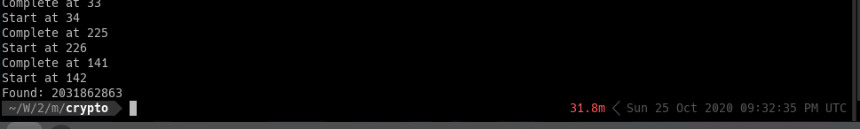

== Embarrassingly Parallel Key Search With Julia

https://computing.llnl.gov/tutorials/parallel_comp/[Image Source]

Recently I play a crypto problem, the problem is quite simple, it's general Feistel cipher construction. You can see the problem at link:encryption.py[]. This is the challenge from http://metactf.com/[MetaCTF 2020].

So the attack is quite general, starts with some analysis:

- Mode of Operation is ECB
- Feistel Construction 
- Offline attack, no oracle provided
- Block size is 64-bit, key size is 32-bit, say in the code. 

Since the key size is 32-bit, it's easy to do a exhaustive search 32-bit space to recover secret key. 

Here was my attempts:

1. Multiple threading with `Python3`
2. Multiple threading with `pypy3`
3. Multiple threading with `Julia`

In `1`, it took quite long to brute 25-bit. 

In `2`, it's faster than 1., still slow. 

In `3`, it's fastest solution. 

The code for `1` and `2` can be found here: link:brute.py[]. Thanks to Zaine Wilson @ MasonCC. 

The code for `3` is developed by me, link:stream_brute.jl[]. If you're using Mobile to read my code, here is the full code. 

[source,julia]
----
mask32 = 0xffffffff
mask64 = 0xffffffffffffffff

function encryptblock(block::UInt64, password::UInt64, rounds)
    
    password = password * 0x8D1B4035 
    password = password

    le = UInt32(0)
    ri = UInt32(0)

    
    le = block >> 32
    ri = block & mask32
    
    for i = 1:rounds
        # println("le: $i $le")
        le = (le << 19) | (le >> 13)
        le &= mask32
        le ⊻= password >> 32
        le ⊻= ri

        tmp = ri 
        ri = le 
        le = tmp 

        password = (password * 3 + 0x5812CE48F3A68B09)
    end

    ciphertext = le << 32 
    ciphertext |=  ri 

    return ciphertext

end

known_pt = UInt64(0x4141414141414141)
known_ct = UInt64(0x212ced02de0ba3d5)

function break_routine(start)
    println("Start at $start")
    pw = UInt64(0)
    
    p1 = UInt8(start)
    for p2 = 0:256
        for p3 = 0:256
            for p4 = 0:256
                pw =  UInt64(p1) << 24
                pw |= UInt64(p2) << 16
                pw |= UInt64(p3) << 8
                pw |= UInt64(p4)
                
                temp = encryptblock(known_pt, pw, 16)
                if temp == known_ct
                    println("Found: $pw")
                    exit(0)
                end
            end
        end
    end

    println("Complete at $start")
end

# Check with Python, make sure it correct
key = UInt64(0x44424344)
ciphertext = encryptblock(known_pt, key, 16)
if ciphertext != 4357724131518883252
    println("WRONG!!! Check the code")
    exit(1)
end

println("PASS, start to brute... .")
# asyncmap(break_routine, range(0, length=256, step=1), ntasks=12)
println(Threads.nthreads())
Threads.@threads for i = 0:255
    break_routine(i)
end

# export JULIA_NUM_THREADS=12
# julia stream_brute.jl
----

To run the code, if you are using Julia version `< 1.5`, then you may have to do `export JULIA_NUM_THREADS=12` where `12` is number of thread in my system. 
Then run `julia stream_brute.jl`

If your Julia version is `>= 1.5`, then just run `julia stream_brute.jl --threads 12`

The code above can be improved further more, since I'm new with Julia so that's all I know. 

Isn't it impressive if we can do parallel tasks this easy? 

[source, julia]
----
Threads.@threads for i = 0:255
    break_routine(i)
end
----

> As conversation with Zaine, his Python version run in *6+* hours. 

My script run in *0.5* hour. So that is *12x* speed up. All scripts are multithreading. 

== Conclusion

Embarrassing Parallel in Julia is so easy, the syntax is pretty like Python. 

One thing I need to keep in mind though, array start at `1`.

== Challenge

If you want to test the performance of Julia in your machine, try to decrypt this my message. 

[source, python]
----
97b0f603bc78c5b215f8404f9f3532bfab75df10bb966fc35b7d8a217e07f5c17f32b158b1b5eb61f1bbe86a47daffa0811b63e0baf5aaab83becd22ef0b24e15011e9901cb4c408b39aa36efc81a63f88fde01463ec013c4911add72947a5da4ca667125061057e4f8e82c018022fbf2658696b32f9c2f1a6e12b51379bdb544f664521053b92ced32674d0d537c4d57913252a05f7637baba004b766a9f7213cf39590b28abb6e4aeb86bbae1653e7381447acd9fdaaea7dff1cd2bb25
----

My padding char is `E`

The code is similar to link:encryption.py[]

Have fun. 