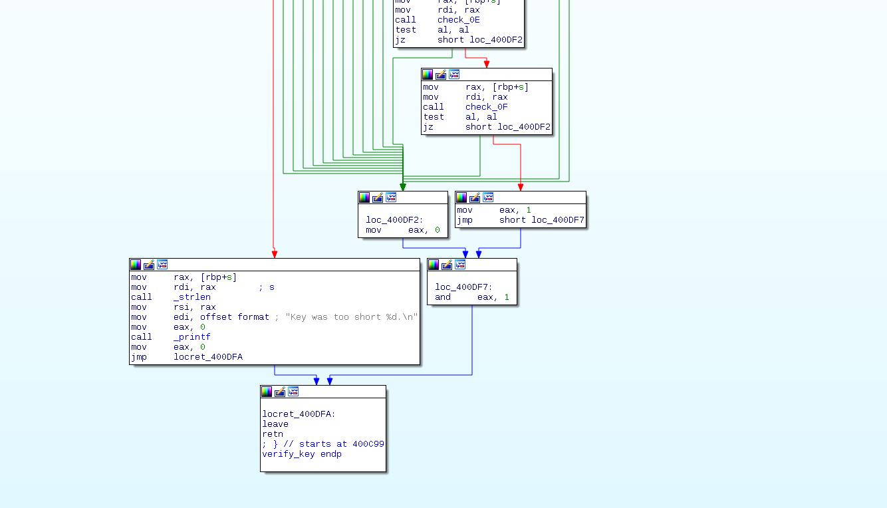
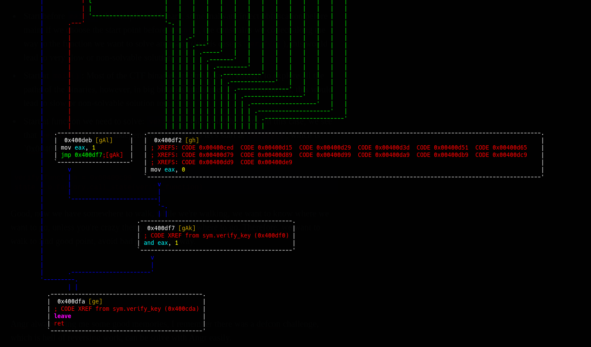
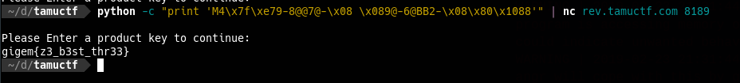
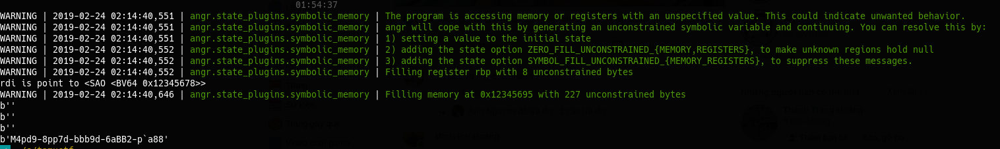

This may be too soon to publish the writeup, but I think if I don't do it now I can't do it anymore.

Before betting on Angr, I check:

Decompiled C code by IDA:  

* No anti-debug, good for automating analysis
* The `verify()` graph has many branches, therefore it possible to do with Pintool
* Decompiled code seem to be solvable with Z3, therefore Angr can solve (because Angr use Z3 as core solver) 

In the worst case I can copy-paste the decompiled C code to solve with Z3 python, this doable but I solve similar challenges a thousand times, so I leave Z3 at the worst-case scenario.

To do automate analysis, now I have 3 options, Pintool or Angr or Radare2 scripting:

* Pintool can only solve the check sequentially, for example: `a[0],a[1],a[2]` ... etc, it's possible to solve it with Pintool, since I don't want to modify the tool so I skip Pintool for now.
* Angr seem a good solution, since the code has no anti-debug (even if it has, I will patch it), there are a few paths to solution: on top-level `main()` function, it checks `verify()` `true` or `false`, and inside `verify() `all sub-functions `check()` must be true.
* Radare2 scripting is a hard work in this case, I normally apply Radare2 for bruting comparison or examing memory purpose. 

The plan is, I will go with Angr, and in case I can't solve it with Angr, I'll use Z3.

Time to solve with Z3: 5 minutes. A solution for this challenge only.

Time to solve with Angr: 30 minutes. Time to sit down and write a script that can be applied to many many basic RE challenges. 

Ok, Let's start Angr. 

[source,python]
----
import angr 

p = angr.Project('prodkey')

----

In automate binary analysis, it's like you walk along the river, you should know where you start, some weirdo people decide to start with some functions before the program enters main() ( for example entry_point() ), some start at main(), some start at verifying (). Here is my explanation of why you should think a bit before choosing a good start point:

* Start before `main()` : In complicated binary, some malware injects obfuscation before main, if we choose the start point before `main()`, we may collect too many constraints to the function we want to solve when we go through unnecessary functions, this would lead to a very slow or non-solvable solution.
* Start at `main()`: Most of the CTF binaries are small, small enough to explore all the paths of the binaries, however, in big binaries and above 10 continuous `if-else` branches, this would lead to a slow or non-solvable solution too.
* Start at a function we need to solve: `verify()`, this would be quick, in this case, we see that `verify()` are quite an independent function. So let's start at `verify()`, which is at `0x00400c99`

[source,python]
----
verify_function = 0x00400c99
state = p.factory.blank_state(addr=verify_function)
----

Good, now we have somewhere to walk, while we're walking, we want to know where we want to go, unless you're crazy then you don't know where to go. Therefore, we want to walk to find good points, avoid bad points on the way. 

Yup, now we know the bad points and good points. If you are a moron then you can go straight to hell at `0x400df2` to have nothing, but we want to have some something, good point is  `0x400deb`

[source,python]
----
good = (0x400deb)
bad = (0x400df2)
----

Now we know where to go, let's fire up the simulation machine, it will collect constraints and solve them for us. 

[source,python]
----
simgr = p.factory.simgr(state)
----

Let's see where are we now? 

[source,python]
----
In [59]: simgr = p.factory.simgr(state)

In [60]: simgr
Out[60]: <SimulationManager with 1 active>

In [61]: simgr.active
Out[61]: [<SimState @ 0x400c99>]
----

Good, no weird things happen, we are standing at the address of `verify()`. Now set up good and bad point or good/bad destination.

`simgr.explore(find=good, avoid=bad)`

[source,python]
----
In [65]: simgr.explore(find=good, avoid=bad)
WARNING | 2019-02-23 21:10:36,634 | angr.state_plugins.symbolic_memory | Filling register rbp with 8 unconstrained bytes
WARNING | 2019-02-23 21:10:36,649 | angr.state_plugins.symbolic_memory | Filling register rdi with 8 unconstrained bytes
WARNING | 2019-02-23 21:10:36,868 | angr.state_plugins.symbolic_memory | Filling memory at 0xffffffffffffff80 with 256 unconstrained bytes
Out[65]: <SimulationManager with 1 deadended, 1 found, 25 avoid>
----

Oops, we found 1 path to a good point. Yay. Let's collect our results. 

[source,python]
----
result = simgr.found[0]

for i in range(3):
    print (result.posix.dumps(i))

Output: 
b''
b''
b''
----

Well, we get empty results. What? Why? How? 

The reason is simple, as you can see in the log when we start exploring paths, we see that the `symbolic memory` is only about `8 bytes` or `256 bytes`, which is incorrect. 

Now let's stop for a bit and think about why: 

* We thought `verify()` is independent function. Unfortunately, it's not, the program receives input and store to memory, and that input is grabbed by `verify()`, we start at `verify()` so `simgr` doesn't know where is that memory comes from.
* If we start somewhere different than `verify()`, we have to do more calculation, it's a trade-off. Well, let's pay the price, let's start at `main()`, during my experiment, if I start at `0x00400e20`, it doesn't work right, although the `fgets_function`  receive the correct parameter setup, I left it as the question after we solve the challenge.
* Still start at `verify()` we will set `symbolic_memory` so `simgr` can fill what it needs. 

Ok, let's go with the trade-off option. Rebuild the script to start at `main` instead.

[source,python]
----
import angr 

p = angr.Project('prodkey')

good = (0x400deb)
bad = (0x400df2)

verify_function = 0x00400c99
fget_function = 0x00400e20
main = 0x00400dfc

state = p.factory.blank_state(addr=main) ## Start at main() 

simgr = p.factory.simulation_manager(state)

simgr.explore(find=good, avoid=bad)

result = simgr.found[0]

for i in range(3):
    print (result.posix.dumps(i))
----

Output:

[source,python]
----
WARNING | 2019-02-23 21:31:44,954 | angr.state_plugins.symbolic_memory | The program is accessing memory or registers with an unspecified value. This could indicate unwanted behavior.
WARNING | 2019-02-23 21:31:44,954 | angr.state_plugins.symbolic_memory | angr will cope with this by generating an unconstrained symbolic variable and continuing. You can resolve this by:
WARNING | 2019-02-23 21:31:44,954 | angr.state_plugins.symbolic_memory | 1) setting a value to the initial state
WARNING | 2019-02-23 21:31:44,954 | angr.state_plugins.symbolic_memory | 2) adding the state option ZERO_FILL_UNCONSTRAINED_{MEMORY,REGISTERS}, to make unknown regions hold null
WARNING | 2019-02-23 21:31:44,954 | angr.state_plugins.symbolic_memory | 3) adding the state option SYMBOL_FILL_UNCONSTRAINED_{MEMORY_REGISTERS}, to suppress these messages.
WARNING | 2019-02-23 21:31:44,954 | angr.state_plugins.symbolic_memory | Filling register rbp with 8 unconstrained bytes
WARNING | 2019-02-23 21:31:45,148 | angr.state_plugins.symbolic_memory | Filling memory at 0x7ffffffffff0000 with 96 unconstrained bytes
WARNING | 2019-02-23 21:31:45,148 | angr.state_plugins.symbolic_memory | Filling memory at 0x7fffffffffeff7e with 106 unconstrained bytes
b'M4\x7f\xe79-8@@7@-\x08 \x089@-6@BB2-\x08\x80\x1088'
b'\nPlease Enter a product key to continue: \n'
b''
----

Wow, the 1st string seems weird but it's the actual solution. Since we don't constrain our solution to be printable, but it's a solution anyway.

Submit and get the flag

Yay, solved it. Can we stop here? Nope.

Let's get back to the optimal solution, where we start at `verify()` and help `simgr` fill the memory it needs. 

In IDA decompiled C code, we see that the array access to array a[28], and the string length check is over `0x1c = 28` (decimal) to satisfy, so let's set the length of input is `29` bytes. We can set the input length longer, it doesn't matter much, Angr is smart if it knows we short of memory, don't worry. 

Because we have the flag, we see that even non-printable string still give us the flag, __the purpose of this post is to introduce you to Angr__, rather than grab a flag and go, so we continue our journey, find out the beauty of the real flag. 

Constrains we have until now:

* Length: 29 bytes
* Printable, a normal product key is often included capital letters, number and dash `-`
* Start at `verify()`

This time, we need to add constraints, although Angr use Z3 as the internal symbolic solver, however, it provides *Claripy* to help users interact with constrains. So now let's add some constraints 

[source,python]
----
import claripy

def AND1(c):
    '''constrain 1: printable'''
    return claripy.And(33 <= c , c <= 126)

length = 29

flag = claripy.BVS('flag', length*8)

for i in range(length):
    state.solver.add( AND1(flag.get_byte(i)) ) 
----

To start at `verify()`, if we check the ASM input, we see the `verify()` has one argument `arg1`, pass to function by `rdi` register. 

[source, bash]
----
/ (fcn) sym.verify_key 355
|   sym.verify_key (char *arg1);
|           ; var char *s @ rbp-0x8
|           ; arg char *arg1 @ rdi
|           ; CALL XREF from main (0x400e45)
|           0x00400c99      55             push rbp
|           0x00400c9a      4889e5         mov rbp, rsp
|           0x00400c9d      4883ec10       sub rsp, 0x10
|           0x00400ca1      48897df8       mov qword [s], rdi   ## point to dummy
|           0x00400ca5      488b45f8       mov rax, qword [s]
|           0x00400ca9      4889c7         mov rdi, rax                ; const char *s
----

Dig deeper into ASM, we easily see `qword [s]` is the local variable, and `verify()` use s to copy input to `check()` function. 

Because we create our own constraints, therefore we need to replace input `arg1` to `verify()` by ours, Angr is smart, let's create a dummy buffer address to store our constrains, after that, we point `rdi` to it, therefore, at setup address `0x00400ca1`, we point our dummy buffer address to local variable `s`

[source,python]
----
my_buf = 0x12345678
state.memory.store(addr=my_buf, data=flag)
state.regs.rdi = my_buf
----

Now, it seems we're done.

Let's prepare the simulation manager, and run. 

[source,python]
----
simgr = p.factory.simulation_manager(state)

good = (0x00400deb)
bad  = (0x00400df2)

simgr.explore(find=good, avoid=bad)

result = simgr.found[0]

# Always print this 
for i in range(3):
    print (result.posix.dumps(i))

print (result.solver.eval(flag, cast_to=bytes))
----

I spent some time to debug why `simgr` found a solution but it doesn't print out, so I need to add the last line to convert constrains to byte strings. If you don't do that, you will be stuck at the ridiculous stage, that the time when you solve the challenge but where is the flag? :)) 

Let's run.

image::flag1.png[]

Wow, this time solution is better. I know you may wonder why after all we did, the solution is not beautiful?

    >     The answer is simple, it's because the author doesn't constrain to unique solution, that's why there are many solutions for the challenge.

Angr always bring me some good memories, I remember there was a DEFCON challenge, which is a hell of reversing work, could be solved with Angr easily.

Oh, memories time. It's 3 years already.

Here is the full script, play with it. 

[source,python]
----
import angr 
import claripy

def AND1(c):
    '''constrain 1: printable'''
    return claripy.And(33 <= c , c <= 126)

def AND2(c):
    '''returns constraints s.t. c is printable'''
    return claripy.And(65 <= c , c <= 90)

def AND3(c):
    '''returns constraints s.t. c is printable'''
    return claripy.And(97 <= c , c <= 122)

p = angr.Project('prodkey')    

verify_function = 0x00400c99
state = p.factory.blank_state(addr=verify_function)

length = 29
flag = claripy.BVS('flag', length*8)

for i in range(length):
    state.solver.add( AND1(flag.get_byte(i)) )
    # state.solver.add( AND2(flag.get_byte(i)) )
    # state.solver.add( AND3(flag.get_byte(i)) )

my_buf = 0x12345678
state.memory.store(addr=my_buf, data=flag)
state.regs.rdi = my_buf

@p.hook(0x00400ca9)
def debug_func(state):
    rdi_value = state.regs.rdi 
    print ( 'rdi is point to {}'.format(rdi_value) )
    

simgr = p.factory.simulation_manager(state)

good = (0x00400deb)
bad  = (0x00400df2)

simgr.explore(find=good, avoid=bad)

result = simgr.found[0]

# Always print this 
for i in range(3):
    print (result.posix.dumps(i))

print (result.solver.eval(flag, cast_to=bytes))
----

So far, in this post, we automate simple binary, which helps us to solve similar binaries in RE category faster. Unlike Z3, we write solutions unique to a challenge, but Angr solution can be adapted to any Z3 solvable challenges.

Next post, we will deal with Anti-Debug binary with Angr. 
