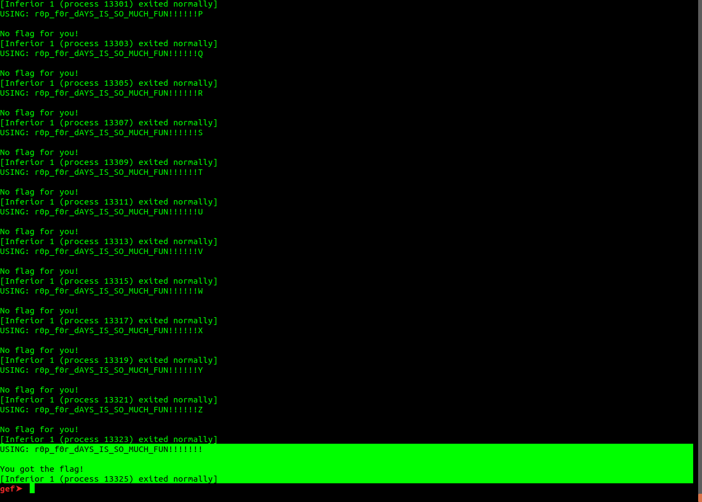

Ở bài viết này, mình sẽ tiến hành reverse tệp tin rop_easy để tìm flag.  
> source file: [rop_easy](https://github.com/minhlongmt183/Reverse101/blob/main/ROPEASY/rop_easy)  
---

# Phân tích tĩnh (static analysis)  
## Tên của file 
- Dễ dàng nhìn thấy tên file là rop_easy, điều đó cho thấy tác giả đã gợi ý bài này liên quan đến ROP. Vậy câu hỏi đầu tiên: ROP là gì?  
- Với những ai chưa biết, ROP (Return Oriented Programming) là một kỹ thuật dùng mà tin tặc dùng để khai thực thi code của họ trên hệ thống của nạn nhân bằng việc điều khiển nội dung và quá trình gọi trên stack. Bạn có thể tìm hiểu kỹ hơn [ở đây](https://bordplate.no/blog/en/post/interactive-rop-tutorial/)

## Thông tin của file 

- Ta sẽ kiểm tra một số thông tin cơ bản của file này với lệnh `file rop_easy`  
```
>file rop_easy
rop_easy: ELF 64-bit LSB shared object, x86-64, version 1 (SYSV), dynamically linked, interpreter /lib64/ld-linux-x86-64.so.2, BuildID[sha1]=81541ee9583b712bc32de672701d8be62da3dc40, for GNU/Linux 3.2.0, stripped
```

- Kết quả trên cho thấy file này là loại ELF 64-bit với phương thức lưu trữ dữ liệu là LSB (Least significant bit). Được stripped do đó tên của các biến, hàm và những thông tin về debugging đều bị xóa đi. Tuy nhiên ta vẫn có thể xác định được địa chỉ hàm main từ lệnh start trong gdb.  

## Kiểm tra các chuỗi trong file
- Ta in tất cả chuỗi trong file với lệnh `strings`.  

- Nó trả về khá nhiều chuỗi, và hầu hết có thể đọc được, cho thấy khả năng cao chương trình này không bị packed.  
- Ta chú ý tới 2 chuỗi `You got the flag!` và `No flag for you!`. Rõ ràng, đây là 2 thông báo tương ứng với trường hợp ta thành công hoặc thất bại trong lúc thực thi.

Với phân tích tĩnh, bước đầu có thể thấy: chương trình này dùng kỹ thuật ROP, do đó luồng thực thi có thể  bị thay đổi theo nội dung trên stack. Nó không bị packed và có thể sẽ yêu cầu mình nhập input và sẽ trả về `You got the flag!` nếu thành công và `No flag for you!` nếu thất bại. Vậy flag mình cần tìm chính là input hợp lệ.  

---
# Phân tích tĩnh (Dynamic Analysis)
## Chạy thử file
- Trước khi chạy 1 binary mà chúng ta không biết rõ nó là gì, tốt nhất nên đảm bảo rằng nó không chứa mã độc trong đó. Một trong những cách đơn giản nhất đó là upload lên [virustotal](https://www.virustotal.com/gui/)  

- Ta tiến hành chạy chương trình: 

- Rõ ràng những gì chúng ta kết luận ở phân tích tĩnh là hợp lý. Chương trình yêu cầu mình nhập input và sẽ trả về `You got the flag!` nếu thành công và `No flag for you!` nếu thất bại. Và flag mình cần tìm chính là input hợp lệ.  
## Tiến hành phân tích với IDA pro
- Tôi sử dụng IDA pro 7.5 để phân tích chương trình này.

- Có khá ít hàm, mặc dù file đã bị striped, nhưng IDA vẫn xác định được hàm main.  

```
; int __fastcall main(int, char **, char **)
main proc near
; __unwind {
endbr64
push    rax
lea     rdi, off_6220
call    near ptr unk_4030
xor     eax, eax
pop     rdx
retn
; } // starts at 3050
main endp
```
- Nó gọi hàm unk_4030(off_6220). Tuy nhiên, khi vào hàm unk_4030 thì: 

```
start:0000000000004030 unk_4030        db  48h ; H             ; CODE XREF: main+C↑p
start:0000000000004031                 db  89h
start:0000000000004032                 db 0FCh
start:0000000000004033                 db 0C3h
```
- Với IDA pro, ta có thể convert những hàm unk_4030 này lại thành assembly bằng cách nhấn phím C. Khi đó ta được.
```
loc_4030:                               ; CODE XREF: main+C↑p
start:0000000000004030                 mov     rsp, rdi
start:0000000000004033                 retn
```
- Chương trình này thực hiện kỹ thuật ROP, đoạn code này được xem là 1 gadget. Nhiệm vụ của nó là đưa nội dung từ rdi lên stack rồi lệnh ret sẽ lấy giá trị từ đỉnh stack ra bỏ vào $rip rồi tăng stack lên. Vì thế, chương trình sẽ tiếp tục thực hiện những lệnh trên stack mà những lệnh này nằm trong off_6220.  
- Chúng ta vào off_6220 và dùng phím C để convert ta có

- Tuy nhiên, cần lưu ý ở đây là dùng phím C thì ta có những trường hợp biến này chứa dữ liệu như là các phân tử trong một mảng thì nó vẫn convert về dạng mã assembly, lúc đó sẽ làm cho hướng đi của chúng ta bị sai lệch.

## Debug bằng gdb
- Cuối cùng, tôi tiến hành debug trên gdb kết hợp với IDA. Vì ROP tận dụng lại những đoạn code (rop gadget) để tạo thành một chuỗi các thực thi, do đó tôi đã note lại từng bước để dễ theo dõi.
- Bạn có thể tham khảo [ở đây](https://github.com/minhlongmt183/Reverse101/blob/main/ROPEASY/note.txt) với input là abc. Có thể sẽ hơi rối một tí với bạn, nhưng đó lại là cách hữu ích với tôi.
- Có một số chỗ đáng lưu ý như sau:
  - Địa chỉ hàm main: `0x555555557050`
  - Chương trình sẽ tiến hành kiểm tra từng ký tự nhập.
  - Với mỗi ký tự lặp, nó sẽ thực hiện một loạt các tính toán bắt đầu từ địa chỉ `0x5555555580ea`
  - Dùng 1 biến để lưu tổng các tính toán của từng ký tự
  - Sau khi xét hết các phần tử của input, nó tính `tổng + (độ_dài_input xor 0x22)`
  - Nếu tổng này bằng 0 thì in `You got the flag!` ngược lại `No flag for you!`.

- Cụ thể, chương trình như sau:

```py
data = [ 
	0xa7c0aac235e24401, 0xfbc27a78732cd5c1, 0xe2bcc8dacc8f3ec1, 
	0x85d5db630397266b, 0x69bea716dfcc2f31, 0x5c8ba862e345f0c1, 
	0x37ff4d930dbf8d49, 0xd8d2a106d49107e3, 0x1a7e8d3ebcdb3381, 
	0x9a508da98d061483, 0xf8f6b6a16de5f681, 0xcd4cc067299fe05b,
	0x7d522ac63e52b6e9, 0x906c70584e07620b, 0x3f57d685d28b6b59,  
	0xe4d62684f5725a53, 0xf440fb91a0cb38f1, 0x1a5b98f646b8e7fb, 
	0xc030861704e18149, 0x5c0f7d9501e27b7b, 0x1fd3fae061fb3959, 
	0x8975066309fb71a3, 0xbb4c46f8d4f95501, 0x986c040271e0462b, 
	0xc21b85b2ba32a8b1, 0x4ab4a8ae2c428723, 0x965b0bcbf404f3c1, 
	0xb4dd1a1572321143, 0xe07a17b5aba8c741, 0xe043c7dee0cc3,  
	0x7444d23acc711ac1, 0xc6b08dadaec60843, 0xdd01213585018e41, 
	0x61c066798641a3c3
]

check_rcx = 0
num_xor = 0x5bc1048e26f1ce02
rcx = 0xabcdef9876543201

len_flag = len(data)

for i in range(len_flag):
	# r9 = 0x1
	# while c > 1:
	#     if c & 1 == 1:
	#         r9 *= rcx
	#     rcx = rcx ** 2
	#     c = c >> 1

	# r9 *= rcx

	r9 = rcx ** c
	check_rcx  += r9 ^ data[i]
    rcx = r9 ^ num_xor


check_rcx += len_flag ^ 0x22

if check_rcx == 0:
    print("You got the flag!")
else:
    fail("No flag for you!")

```
- Có thể bạn sẽ thắc mắc làm sao tìm được array data? Trong quá trình debug, thử với nhiều input khác nhau thì tôi để ý thấy giá trị để xor với r9 với các input khác nhau thì thứ tự xuất và giá trị tương ứng lại giống nhau. Ta nghĩ ngay đến trường hợp các giá trị này nằm trong 1 mảng, do đó tôi đã đi tìm trong IDA Pro. Phải tốn khá nhiều thời gian mới tìm được, lý do tôi đã convert chúng thành lệnh asm (dùng phím C). Chú ý, dữ kiện chương loại ELF 64-bit với phương thức lưu trữ dữ liệu là LSB (Least significant bit) ở phân tích tĩnh mà chuyển data trên về khỏi bị sai sót.


# Giải bài toán
- Sau khi đã hiểu rõ chương trình, ta tiến hành giải tìm flag.
- Ta có len(flag) = len(data) = 0x22, do đó biếu thức `len_flag ^ 0x22` có giá trị là 0. Từ đó ta có ý tưởng là làm cho từng số hạng trong tổng `check_rcx  += r9 ^ data[i]` đều có giá trị là 0. Ta tiến hành brutefore từng ký tự nhập sao cho số hạng `r9 ^ data[i]` có giá trị là 0.

```py
import string

data = [ 
	0xa7c0aac235e24401, 0xfbc27a78732cd5c1, 0xe2bcc8dacc8f3ec1, 
	0x85d5db630397266b, 0x69bea716dfcc2f31, 0x5c8ba862e345f0c1, 
	0x37ff4d930dbf8d49, 0xd8d2a106d49107e3, 0x1a7e8d3ebcdb3381, 
	0x9a508da98d061483, 0xf8f6b6a16de5f681, 0xcd4cc067299fe05b,
	0x7d522ac63e52b6e9, 0x906c70584e07620b, 0x3f57d685d28b6b59,  
	0xe4d62684f5725a53, 0xf440fb91a0cb38f1, 0x1a5b98f646b8e7fb, 
	0xc030861704e18149, 0x5c0f7d9501e27b7b, 0x1fd3fae061fb3959, 
	0x8975066309fb71a3, 0xbb4c46f8d4f95501, 0x986c040271e0462b, 
	0xc21b85b2ba32a8b1, 0x4ab4a8ae2c428723, 0x965b0bcbf404f3c1, 
	0xb4dd1a1572321143, 0xe07a17b5aba8c741, 0xe043c7dee0cc3,  
	0x7444d23acc711ac1, 0xc6b08dadaec60843, 0xdd01213585018e41, 
	0x61c066798641a3c3
]
mask = 2**64 - 1
check_rcx = 0
num_xor = 0x5bc1048e26f1ce02
rcx = 0xabcdef9876543201

len_flag = len(data)

for i in range(len_flag):
    for char in string.printable:
        c = ord(char)

        if (rcx ** c) & mask == data[i]:
            print(char, end="")
            break

    rcx = data[i] ^ num_xor
```
- Chạy đoạn mã trên, ta đươc flag là: `r0p_f0r_dAYS_IS_SO_MUCH_FUN!!!!!!!`

# Cách giải khác
- Bởi vì chương trình sẽ kiểm tra từng ký tự, và sẽ tính toán số hạng `r9 ^ data[i]`, do đó ta có thể giải bằng cách bruteforce để tìm từng kí tự tương ứng với ràng buộc, mỗi ký tự sẽ làm cho số hàng `r9^data[i]` có giá trị là 0.  
- Tôi dùng python gdb để giải quyết vấn đề này.  

```py
class bp(gdb.Breakpoint):
    def stop(self):
        global encode, idx, check
        if idx % 2 == 0:
            x = execute_redirect("x/s $rax")
            encode = x.split(":")[0]
            check[int(idx / 2)] = int(encode, 16)
        idx += 1
bp("*0x5555555580d9")
```

- Mục tiêu của chúng ta kiểm tra phép xor phải bằng 0, nên tôi đặt breakpoint tại địa chỉ `0x5555555580d9` của gadget: 

```
0x5555555580d7                  xor    eax, ecx
0x5555555580d9                  ret 
```
- Tôi nhận ra, với mỗi kí tự giá trị gadget trên sẽ được gọi lần thứ 2 để tính số hàng `r9 ^ data[i]` do đó tại nơi này lưu giá trị `$rax` của từng kí tự vào list check. Hàm `execute_redirect` được dùng để lấy output từ command ở gdb, code này tôi tham khảo từ [gdb pda](https://github.com/longld/peda/blob/62b368fa3d88623bee3c15c39d7922455ec7dfe5/lib/config.py).

```py
import gdb
import string
 
READELF      = "/usr/bin/readelf"
OBJDUMP      = "/usr/bin/objdump"
NASM         = "/usr/bin/nasm"
NDISASM      = "/usr/bin/ndisasm"

# PEDA global options
OPTIONS = {
    "badchars"  : ("", "bad characters to be filtered in payload/output, e.g: '\\x0a\\x00'"),
    "pattern"   : (1, "pattern type, 0 = basic, 1 = extended, 2 = maximum"),
    "p_charset" : ("", "custom charset for pattern_create"),
    "indent"    : (4, "number of ident spaces for output python payload, e.g: 0|4|8"),
    "ansicolor" : ("on", "enable/disable colorized output, e.g: on|off"),    
    "pagesize"  : (25, "number of lines to display per page, 0 = disable paging"),
    "session"   : ("peda-session-#FILENAME#.txt", "target file to save peda session"),
    "tracedepth": (0, "max depth for calls/instructions tracing, 0 means no limit"),
    "tracelog"  : ("peda-trace-#FILENAME#.txt", "target file to save tracecall output"),
    "crashlog"  : ("peda-crashdump-#FILENAME#.txt", "target file to save crash dump of fuzzing"),
    "snapshot"  : ("peda-snapshot-#FILENAME#.raw", "target file to save crash dump of fuzzing"),
    "autosave"  : ("on", "auto saving peda session, e.g: on|off"),
    "payload"   : ("peda-payload-#FILENAME#.txt", "target file to save output of payload command"),
    "context"   : ("register,code,stack", "context display setting, e.g: register, code, stack, all"),
    "clearscr"  : ("on", "clear screen for each context display"),
    "verbose"   : ("off", "show detail execution of commands, e.g: on|off"),
    "debug"     : ("off", "show detail error of peda commands, e.g: on|off"),
    "_teefd"    : ("", "internal use only for tracelog/crashlog writing")
}

class Option(object):
    """
    Class to access global options of PEDA commands and functions
    TODO: save/load option to/from file
    """
    options = OPTIONS.copy()
    def __init__(self):
        """option format: name = (value, 'help message')"""
        pass

    def get(name):
        """get option"""
        if name in Option.options:
            return Option.options[name][0]
        else:
            return None


def tmpfile(pref="peda-", is_binary_file=False):
    """Create and return a temporary file with custom prefix"""

    mode = 'w+b' if is_binary_file else 'w+'
    return tempfile.NamedTemporaryFile(mode=mode, prefix=pref)

def execute_redirect(gdb_command, silent=False):
 
    result = None
    #init redirection
    if silent:
        logfd = open(os.path.devnull, "r+")
    else:
        logfd = tmpfile()
    logname = logfd.name
    gdb.execute('set logging off') # prevent nested call
    gdb.execute('set height 0') # disable paging
    gdb.execute('set logging file %s' % logname)
    gdb.execute('set logging overwrite on')
    gdb.execute('set logging redirect on')
    gdb.execute('set logging on')
    try:
        gdb.execute(gdb_command)
        gdb.flush()
        gdb.execute('set logging off')
        if not silent:
            logfd.flush()
            result = logfd.read()
        logfd.close()
    except Exception as e:
        gdb.execute('set logging off') #to be sure
        if Option.get("debug") == "on":
            msg('Exception (%s): %s' % (gdb_command, e), "red")
            traceback.print_exc()
        logfd.close()
    if Option.get("verbose") == "on":
        msg(result)
    return result
 
```

Và hàm main là hàm tiến hành chạy và bruteforce từng ký tự.
```py
def main():
    global encode, idx, check
    code = ["_"] * 0x22
    for j in range(0x22):
        for i in string.printable:
            code[j] = i
            if i == "\"" or i == "`" or i == "'" or i == "\\":
                code[j] = "\\" + i 

            idx = 0
            check = [-1]*0x23

            print("USING:",''.join(code) + '\n')
            gdb.execute("run < <(python -c \"print '" + ''.join(code) + "'\")")

            if check[j] == 0:
                break
```
- Tiến hành chạy
```
gdb ./rop_easy
source scriptting.py
```
- Chạy và ta được kết quả:

- Sau khi chạy xong:


## Nhược điểm
- Thuật toán bruteforce có nhược điểm là thơi gian chạy hơi lâu, tôi chạy mất khoảng 5-10'. Tôi sẽ nghiên cứu và cải thiện nó trong tương lai.
- Bạn có thể tham khảo full script [tại đây](https://github.com/minhlongmt183/Reverse101/blob/main/ROPEASY/scriptting.py)