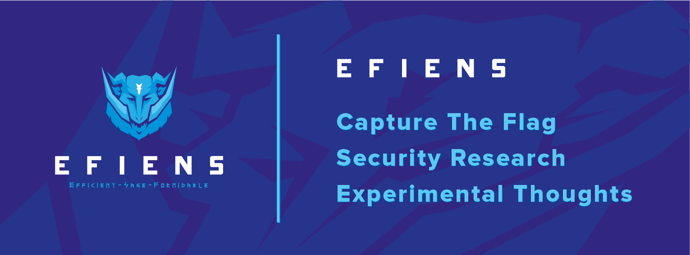

== Efiens Server Structures

So Efiens's blog has been restructured. From now on, we are no longer use a single central server to distribute our contents, Ghost blog is okay, but not good enough for us. 

Efiens's blog is faster than ever. 

For years, we have a burden to maintain our server, which is not so simple, we have a blog, front page, deployed in the same server, we forget to do `apt-get update` now and then, we have exploit toolkits on our server, sometimes we don't know that connect backs are us or them, and we were so scared that someday something may happen to our servers, since we try to minimize our budget, many tasks, such as VPN, Discord's bot, Web Services, and security tools are in 01 single server, as long as we go, we need to change this situation. 

So here are our plans: 

- All static contents will be deployed using Netlify. Because it's fast and free. 
- All security tool kits from now have the freedom to be deployed on temporary servers, we only need to fire and forget, even if we accidentally burn our server, we happily create a new one. Many wonderful philosophies in life start from simple, stupid things. 
- Yes, we plan to have a mail server too, our attitude with the mail server is to not store our secret life in there, it's not replacing our private emails, but it extends our professional careers, we will do our best to secure our mail server. 

With Blog, the soul of our team, has moved to Netlify. FrontPage will soon be converted to static contents, turn out, it's easier for us, to write our content in any format, Asciidoc, Latex, Markdown, with a simple pull request, your content will be deployed instantly. And the world can reach it in `5ms`, isn't it awesome? 

Compare to the loading time between Ghost Blog and Netlify: `200ms` vs `5ms`. Do your math. :) 

Let's talk about budget, since the start, for years, we had received generous sponsors from alumni, VNG, those budget from early start mean a lot to us, hosting Virtual Private Server (VPS) and renewing `efiens.com` domain had cost a lot and keep increasing per year. 

When we bought `efiens.com`, it's dirt cheap, for years, we gained worldwide web attention (that's good news), our domain has increased its ranking, follow that, our domain registrar `Godaddy` increase renewal price and put us in a hostile situation every time. So we drop Godaddy, move to Cloudflare, the renew fee is now fixed, $9 per year, it's back to dirty cheap again. But for sure we don't want to give up our domain at any time until the end of time.

About VPS, we cut from 2 servers to only 1 server: Mail server. And that's it. Other servers are for fire and forget purposes, they have a short life span, probably 3 days after a CTF, or 2 months for Qualifying Rounds, thus, it's cheap.

In the long run, this choice not only save us some money (although it's doesn't matter at the moment), but also keep our head up for incoming challenges, we get in touch with modern web technology, content distribution, writing Markdown, Latex, in which, may be useful for some of us in the future. Simplifying our architecture is to drop the burdens on our shoulders.

No one has to wake up in the middle of the night, rush to update our server when we read about new networking exploits, simply have a good sleep. 

== Blogging Structure

=== Install Go language 

Make sure you install Go module that supports `go mod`. 

Do `sudo apt-get update && sudo apt-get upgrade -y` to upgrade your Go to new version.

=== Install Hugo-extended

Hugo comes with 2 versions, a static generator, and extended version. Use `extended`

[source,bash]
----
$ hugo version
Hugo Static Site Generator v0.76.5-60F0725B/extended linux/amd64 BuildDate: 2020-10-14T15:25:14Z
----

Don't waste time to build from source code, there are prebuilt `deb` package in https://github.com/gohugoio/hugo/releases

=== So... How to write content in this blogging style? 

Simple in 3 steps:

- Run `git clone git@github.com:efiens/blog.efiens.com.git`
- Run `cd blog.efiens.com`
- Run `hugo server`

If you don't have any busy ports, by default hugo will start at `http://localhost:1313/`

This is interactive writing, so you need to prepare a code editor that supports Markdown, like Visual Code, Sublime, Notepad++ or Vim, whatever works.

If your name has not appeared as a folder in `content/authors/`, then:

- `hugo new  --kind authors authors/new_name`. Replace `new_name` with the nickname you want. 
- `cd content/authors/new_name/`
- Pick a png or jpg picture that represents you, name it `avatar.jpg` or `avatar.png`
- Modify `_index.md`
- Enable yourself as superuser. `superuser: true`. We value all members who contribute to Efiens's blog. And it looks nicer in the page too. 
- In `user_groups`, set one of the 3 following:

** *Members*: You've passed the qualify round
** *Core Members*: Your shirts have `sudo`
** *Advisors*: Beside CTF activity, you help manage the club.

- In `role`, describe your responsibility within 3 words. For example, `Pwn` is my main category, set `role: Pwner`, be creative. You can be a `memer` and that's fine. :))

- In `education`, the next generation of Efiens may come from your high school, so you may want to add high school and your achievements as well, so feel free to list them. 

- In `interests`, list your interests in security, it can be both what you do and what you like to do in the future.

Done. You only need to do this once. Then commit it. 

- `git add content/authors/new_name`
- `git commit -m "Add myself to Efiens Blog"`

To start to write a post, then: 

- `hugo new --kind post post/this-is-a-post`. Remember the `-` is important, it's automatically replaced by space in the title. Why there is `-` there? Because `bash` separate arguments by space. 
- `cd content/post/this-is-a-post/`
- Edit `index.md`, if you want to use **Asciidoc** like me, just rename it to `index.adoc`. 
- If you want to attach any image, just include the image in the same folder, then call it.

Done. You can start to write a post. 

In case you get errors:

- `Ctr+C` to stop hugo and then run `hugo server` again. Sometimes the error from built cache. 
- Undo what you just did, because what you're writing in the markdown file is rendering in real-time. 

Syntax lighting is available, supported languages are at `config/_default/params.toml` line 60, if your language is not there, then add one. 

To add the right language, check here: `https://cdnjs.com/libraries/highlight.js/`. `Ctr+F` search for `languages/java`, it's case sensitive so you want to grab the right name. 

[source,c]
----
int8_t shift1(int32_t edx, int8_t eax)
{
    int32_t t1, t2, t3;
    uint32_t ut1, ut2, ut3;

    int32_t ret;

    edx = edx + eax;
    t1 = edx;
    t2 = (int32_t) t1 >> 0x1f;
    ut2 = (uint32_t)t2 >> 0x1c;
    t3 = edx + ut2;
    t3 = t3 & 0xf;
    t3 = edx - eax;

    return t3;  
----

After you are done with writing the post, it's time to `commit` and `push` to Efiens Organization repo. 
Run: 

- `git add content/post/this-is-a-post`
- `git commit -m "Add post for CTF xyz"`

Done. Easy. 

Finish? Check to see if you missed anything? 

- Run `git push` and your content will be published within 1 minute. 

Netlify will rebuild the website right after it changes. 

So quick and so easy. 

=== Do I need to care about other files? 

No, you only need to care about `content/authors` and `content/post`

- Each folder in `content/authors` represent for each `author`
- Each folder in `content/post` represent for each `post`

=== What about other files? 

This blog.efiens.com will not stop here, we will add more features to this blog, since it supports many many features, we can add `talks`, `publication` section to our blog.

Eventually, this blog becomes a Wikipedia for us, the collection of our knowledge. 

=== I want to add a featured picture? 

Simple. Add picture in the `content/post/this-is-a-post` directory, name it `featured.jpg` or `featured.png`, then it will work.

== Conclusion

The new blogging platform is awesome. We are not longer stick at one simple central web server. You can feel free to port your CTF writeup in markdown here. Just copy and paste it. 

Done. 