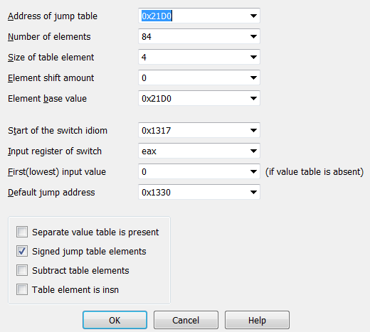

## pickled-onions
{}
**Given files:** [chall.py](pickle/chall.py)
{}

### Analyzing the source code:
We are given a .py file, so the first thing I did was throwing that in a text editor. 
```py
__import__('pickle').loads(b'(I128\nI4\nI99\nI112\nI105\nI99... #truncated )
```
The source contains just one line of code and it has something to do with [pickle](https://docs.python.org/3/library/pickle.html), which is a built-in python model used for "serializing and de-serializing a Python object structure". In other words, it converts a python object to a byte stream, and vice versa.

After googling for a while, I learned that the byte stream is a sequence of opcodes for the `Virtual pickle machine`. This is a stack-based VM that will interpret those opcodes and build python objects for us. I also learned that, with the right opcodes, `Virtual pickle machine` can [execute Python code](https://adrianstoll.com/computer-insecurity/python-in-a-pickle.html)!

If we try running the provided .py script, it will ask us for the correct input. But we don't see that anywhere in the source code. At this point, I was pretty sure that this program uses the pickle VM to execute something, so the main logic is (probably) in that long byte stream.

### Analyzing the pickle opcodes:
Pickle opcodes are one character and followed by their arguments, arguments are terminated with a newline. You can take a look at the list of all opcodes and what each of them does [here](https://github.com/python/cpython/blob/main/Lib/pickle.py#L111)

Luckily, we don't have to parse those opcodes by hand. Python has a built-in module -  [pickletools](https://docs.python.org/3/library/pickletools.html) - to help us do just that. Using `pickletools.dis()`, we will have the disassembled version of our opcode.

```py
pickletools.dis(b'(I128\nI4\nI99\nI112\nI105\nI99... #truncated )
```

```
/*...*/
544203: I        INT        73
544207: I        INT        54
544211: I        INT        52
544215: I        INT        10
544219: I        INT        133
544224: I        INT        82
544228: I        INT        133
544233: I        INT        82
544237: I        INT        147
544242: I        INT        133
544247: I        INT        82
544251: I        INT        133
544256: I        INT        82
544260: I        INT        133
544265: I        INT        82
544269: I        INT        46
544273: t        TUPLE      (MARK at 0)
544274: p    PUT        69420
544281: c    GLOBAL     'pickle loads'
544295: c    GLOBAL     'builtins bytes'
544311: g    GET        69420
544318: \x85 TUPLE1
544319: R    REDUCE
544320: \x85 TUPLE1
544321: R    REDUCE
544322: .    STOP
```

The program pushes a bunch of numbers into the stack and once again calls `pickle.loads()`, which means those numbers are pickle opcodes. With the help of `pickletools.genops()`, I was able to extract the numbers and disassemble them.

```py
tup = []
for op in pickletools.genops(code):
    (opcode, arg, pos) = op    
    if (opcode.name == "INT"):
        tup.append(arg)
pickletools.dis(bytes(tup))
```

``` 
   13: (    MARK
   14: \x8c     SHORT_BINUNICODE 'pickledhorseradish'
   34: C        SHORT_BINBYTES b'\x80\x04cpickle\nio\ncio\npickledmacadamia.__add__\ncio\npickledbarberry\n\x85R.'
  101: \x8c     SHORT_BINUNICODE 'pickledcoconut'
  117: C        SHORT_BINBYTES b'\x80\x04cpickle\nio\ncio\npickledmacadamia.__sub__\ncio\npickledbarberry\n\x85R.'

/*...*/

119476: \x8c     SHORT_BINUNICODE 'pickledpupunha'
119492: \x8c     SHORT_BINUNICODE 'Nope!'
119499: \x8c     SHORT_BINUNICODE 'Correct!'
119509: \x86     TUPLE2
119510: \x8c     SHORT_BINUNICODE 'pickledximenia'
119526: c        GLOBAL     'builtins input'
119542: \x8c     SHORT_BINUNICODE 'What is the flag? '
119562: \x85     TUPLE1
119563: R        REDUCE
119564: \x8c     SHORT_BINUNICODE 'pickledgarlic'
119579: \x8c     SHORT_BINUNICODE 'pickledcorneliancherry'
119603: \x8c     SHORT_BINUNICODE 'pickledboysenberry'
119623: \x86     TUPLE2
119624: d        DICT       (MARK at 13)
```

Now it builds a `dict`, with entry `pickledximenia` contains our input, `pickledpupunha` contains the tuple `("Nope!", "Correct!")`, `pickledgarlic` contains the tuple `('pickledcorneliancherry', 'pickledboysenberry')` and the rest are just opcodes. After that, we can see there are many function calls.
```
119722: b    BUILD
119723: c    GLOBAL     'builtins print'
119739: c    GLOBAL     'io pickledpupunha.__getitem__'
119770: c    GLOBAL     'pickle loads'
119784: \x8c SHORT_BINUNICODE 'io'
119788: c    GLOBAL     'io pickledgarlic.__getitem__'
119818: c    GLOBAL     'io pickledburmesegrape.__eq__'
119849: I    INT        64
119853: \x85 TUPLE1
119854: R    REDUCE
119855: \x85 TUPLE1
119856: R    REDUCE
119857: \x93 STACK_GLOBAL
119858: \x85 TUPLE1
119859: R    REDUCE
119860: \x85 TUPLE1
119861: R    REDUCE
119862: \x85 TUPLE1
119863: R    REDUCE
119864: .    STOP
```

The above code can be roughly rewritten as:
```py
print(pickledpupunha[pickledgarlic[len(ourInput) == 64]()])
```
We want the program to print `Correct!`, so the input has to be 64-char long. On top of that, `pickledgarlic[1]()`, a.k.a `pickledboysenberry()` has to return 1.

Repeating the process above, we can get the disassembled code for `pickledboysenberry`. This function constructs even more pickle opcodes, which will be used to check our input. Again, using `pickletools.genops()` and `pickletools.dis()`, we can extract those opcodes. Those functions are fairly simple. We have `pickledblackapple` to check if each character is in the range from 32 to 127. The rest of the functions follow the same pattern: push every char of input to stack, pop them out one by one and save the chars it needs, then finally perform an arithmetic check. For example, this is a checking function: `pickledgalendar`

```
/*...*/
  253: 0    POP
  254: 0    POP
  255: 0    POP
  256: 0    POP
  257: 0    POP
  258: p    PUT        0
  261: 0    POP
  262: c    GLOBAL     'pickle io'
  273: (    MARK
  274: \x8c     SHORT_BINUNICODE 'pickledmacadamia'
  292: g        GET        0
  295: \x8c     SHORT_BINUNICODE 'pickledbarberry'
  312: g        GET        1
  315: \x8c     SHORT_BINUNICODE 'pickledgarlic'
  330: \x8c     SHORT_BINUNICODE 'pickledcorneliancherry'
  354: \x8c     SHORT_BINUNICODE 'pickledmonstera'
  371: \x86     TUPLE2
  372: d        DICT       (MARK at 273)
  373: b    BUILD
  374: c    GLOBAL     'pickle loads'
  388: \x8c SHORT_BINUNICODE 'io'
  392: c    GLOBAL     'io pickledgarlic.__getitem__'
  422: c    GLOBAL     'pickle io'
  433: (    MARK
  434: \x8c     SHORT_BINUNICODE 'pickledmacadamia'
  452: c        GLOBAL     'pickle loads'
  466: c        GLOBAL     'io pickledlychee'
  484: \x85     TUPLE1
  485: R        REDUCE
  486: \x8c     SHORT_BINUNICODE 'pickledbarberry'
  503: I        INT        57
  507: d        DICT       (MARK at 433)
  508: b    BUILD
  509: 0    POP
  510: c    GLOBAL     'pickle loads'
  524: c    GLOBAL     'io pickledcrabapple'
  545: \x85 TUPLE1
  546: R    REDUCE
  547: \x85 TUPLE1
  548: R    REDUCE
  549: \x93 STACK_GLOBAL
  550: \x85 TUPLE1
  551: R    REDUCE
  552: .    STOP
```

### Finding the flag:
Since every functions follow a fixed pattern, we can easily iterate over their opcodes and generate constraints for our z3 solver.
```py
s = Solver()
flag = [BitVec("x%d"%(i), 8) for i in range(64)]

def calVars(v1, v2, calculation):
    val = v1
    if calculation == "pickledhorseradish":
        val += v2
    elif calculation == "pickledcoconut":
        val -= v2
    elif calculation == "pickledlychee":
        val ^= v2
    return val
    
def addConstraint(s, v1, v2, compare):
    if compare == "pickledcrabapple":
        s.add(v1 == v2)
    elif compare == "pickledportabella":
        s.add(v1 != v2)
    elif compare == "pickledquince":
        s.add(v1 <= v2)
    elif compare == "pickledeasternmayhawthorn":
        s.add(v1 >= v2)


calculateFuncs = ["pickledhorseradish", "pickledcoconut", "pickledlychee"]
compareFuncs = ["pickledcrabapple", "pickledportabella", "pickledquince", "pickledeasternmayhawthorn"]

for func in checkFuncs:
    iter = pickletools.genops(checkFuncs[func])
    varId = 63
    vars = {}
    calculation = None
    compare = None
    for op in iter:
        (opcode, arg, pos) = op
        if (opcode.name == "POP"):
            varId -= 1
        if (opcode.name == "PUT"):
            vars[arg] = flag[varId]
        if (arg == "pickledmacadamia"):
            (nextOp, nextArg, nextPos) = next(iter)
            if (nextOp.name == "GET"):
                pickledmacadamia = vars[nextArg]
            elif (nextOp.name == "INT"):
                pickledmacadamia = nextArg
        if (arg == "pickledbarberry"):
            (nextOp, nextArg, nextPos) = next(iter)
            if (nextOp.name == "GET"):
                pickledbarberry = vars[nextArg]
            elif (nextOp.name == "INT"):
                pickledbarberry = nextArg
        if (opcode.name == "GLOBAL" and arg.replace("io ", "") in calculateFuncs):
            calculation = arg.replace("io ", "")
            pickledmacadamia = calVars(pickledmacadamia, pickledbarberry, calculation)
        if (opcode.name == "GLOBAL" and arg.replace("io ", "") in compareFuncs):
            compare = arg.replace("io ", "")
    addConstraint(s, pickledmacadamia, pickledbarberry, compare)
```

And the flag is `flag{n0w_th4t5_4_b1g_p1ckl3_1n_4_p1ckl3_but_1t_n33d3d_s0m3_h3lp}`

Full script: [solve.py](pickle/solve.py)

## 2k
{}
**Given files:** [chall](2k/chall), [prog.bin](2k/prog.bin)
{}

### Analyzing main function and parsing the opcodes:
We are given a 64bit ELF, so straight to IDA it goes.

The main function first does some basic stuff like: allocate a buffer, read `prog.bin`, etc...
After that, it iterates over each byte of `prog.bin` and does this:
```c
    if ( progBin_[i] <= 0x53u )
      __asm { jmp     rax }
```
IDA can't decompile this, so we have to read the assembly code. Doing so shows me that this is clearly a switch-case statement, with the jump table at 0x21d0:
```asm
.text:00000000000012E1                 lea     r15, unk_21D0
/..../
.text:0000000000001300                 cmp     byte ptr [rbp+rax+0], 53h ; 'S'
.text:0000000000001305                 lea     r13d, [rdx+1]
.text:0000000000001309                 ja      short loc_1330
.text:000000000000130B                 movzx   eax, byte ptr [rbp+rax+0]
.text:0000000000001310                 movsxd  rax, dword ptr [r15+rax*4]
.text:0000000000001314                 add     rax, r15
.text:0000000000001317                 db      3Eh
.text:0000000000001317                 jmp     rax
```
My teammate @redandblue found a [blog](https://kruztw.tw/ida-%E8%A8%AD%E5%AE%9A-switch-case/) that show us how manually define switch-case statements in IDA. For this challenge, just go to `Edit -> Other -> Specify switch idiom`, then use the following config:



{}
While IDA can't recognize a switch statement like this, BinaryNinja can do it pretty well. So if you don't want to configure anything, BinaryNinja is a good choice.
{}

After defining the switch statement, we can easily see that this is a stack-based VM. Here's a short summary about all of its opcodes:

- `0x1`: Duplicate the topmost value of the stack.
- `0x2`: Pop a value from stack.
- `0x3`: Print the flag if the topmost value on stack is 0.
- `0x10, 0x11, 0x12, 0x13, 0x14, 0x15`: arithmetic operations
- `0x16, 0x17`: comparing operations
- `0x20, 0x21`: input/output operations
- `0x22`: push a specified number to stack
- `0x30, 0x31, 0x32, 0x33, 0x34, 0x35, 0x36`: jump statements
- The program also has an array to be used as "memory" for the VM, and the last 6 opcodes: `0x40, 0x41, 0x50, 0x51, 0x52, 0x53` are operations on this memory.

After knowing the functionality of every opcodes, I wrote a simple disassembler for `prog.bin`
```py
with open("prog.bin", "rb") as f:
    opcodes = f.read()
    
opName = {1: "DUP", 2: "POP", 3: "CHECK", 0x10: "ADD", 0x11: "SUB", 0x12: "MUL", 0x13: "DIV", 0x14: "MOD", 0x15: "MUL_MOD", 0x16: "IS_EQ",
    0x17: "CMP_0", 0x20: "INPUT", 0x21: "PRINT", 0x22: "PUT", 0x30: "JMP", 0x31: "JZ", 0x32: "JNZ", 0x33: "JLZ", 0x34: "JGZ", 0x35: "JLEZ",
    0x36: "JGEZ", 0x40: "STACK_TO_ARR", 0x41: "ARR_TO_STACK", 0x50: "INC_ARR_PTR", 0x51: "DEC_ARR_PTR", 0x52: "ADD_ARR_PTR", 0x53: "SUB_ARR_PTR"} 

rip = 0
while rip < len(opcodes):
    op = opcodes[rip]
    
    if (op != 0x22):
        print(str(rip) + ":\t\t" + opName[op])
        rip += 1
    else:
        print(str(rip) + ":\t\t" + opName[op] + "\t\t" + str(struct.unpack("<H", opcodes[rip + 1:rip + 3])[0]))
        rip += 3
```

### Solving using z3:
Thanks to the disassembler, we can now understand what `prog.bin` is trying to do.
```
0:		PUT		12
3:		JMP
4:		PUT		1
7:		CHECK
8:		PUT		0
11:		CHECK
12:		PUT		115
```
First, it jumps straight to address 12. But notice that, at address 8, the program pushes 0 to stack then executes the print flag instructions. We know that the program only gives us the flag if the topmost value on the stack is 0, so this must be the address we need to reach. By the same logic, we don't want to get to address 4.

At address 12, the program prints out the string "`sice dice:`", then ask us for 64 bytes of input. It then subtracts each char by `0x2f` and puts our input to memory. After that, it performs a series of checks, following the pattern: load input char(s) from memory --> perform arithmetic operations --> compare against a constant --> jump to address 4 if the comparison is wrong.

Since there are over 6000 lines in the disassembled opcode, reading all of them and solving manually is out of the question. Instead, I tried to emulate all the opcodes in python and generate constraints for z3 automatically. 

We will supply the input as z3 BitVec, and whenever there is a conditional jump to address 4, we can just skip the jump and add an appropriate constraint to z3 solver.

```py
flag = [BitVec("x%d"%(i), 16) for i in range(64)]
flagPos = 0

.....

    elif op == 0x20:			#input
        stack.append(flag[flagPos])
        flagPos += 1
        rip += 1
        
.....

    elif op == 0x31:            #jump if zero
        addr = stack.pop()
        token = stack.pop()
        if addr == 4:
            s.add(token != 0)
            rip += 1
        elif token == 0:
            rip = addr
        else:
            rip += 1
```

Since all the character is subtracted by `0x2f` before they are put to the memory, and I don't want to deal with negative numbers, I added the following constraints to z3.

```py
for i in flag:
    s.add(And(i >= 48, i <= 127))
```

The script will generate false inputs if I remove that, so there must still be something wrong with my code. Nevertheless, it still managed to give me one correct input, and that is enough to get the flag: `flag{kenken_is_just_z3_064c4}` 

Full script: [solve.py](2k/solve.py)


