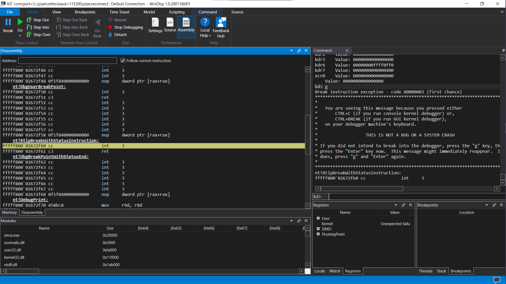

A memo to debug the kernel of Windows with WinDbg


Open the Windows virtual machine cmd as admin. Open a COM port

```
bcdedit /dbgsettings serial debugport:1 baudrate:115200
```

To enable debug in kernel mode

```
bcdedit /debug on
```

To enable debug the boot manager and bootloader:

```
bcdedit /bootdebug {bootmgr} on # boot manager
bcdedit /bootdebug {current} on # bootloader
```

Shutdown the machine. Edit the setting in VirtualBox/VMWare:

1. Open a serial port 1
2. Set the mode to Pipe
3. Set the path to `\\.\pipe\pipename`

Open WinDbg or WinDbg Preview. Choose attach to kernel. Set the baudrate as specified and Port as `\\.\pipe\pipename`.

Turn on initial break to break automatically when a module is loaded in memory (bootmgr, winload.exe, winload.efi, ntoskrnl.exe).

Run the VM. Unless inital break is on, else press break to break.

Simple table to understand

| Command                         | Debug What                |                      |
|---------------------------------|---------------------------|----------------------|
| bcdedit /debug on               | ntoskrnl.exe              | Windows Kernel       |
| bcdedit /bootdebug {bootmgr} on | bootmgr.exe / bootmgr.efi | Windows Boot Manager |
| bcdedit /bootdebug {current} on | winload.exe / winload.efi | Windows Bootloader   |


Sufffix .efi is used in UEFI boot mode.

[Windows reference on boot process](https://docs.microsoft.com/en-us/windows/client-management/advanced-troubleshooting-boot-problems)


If we want to set inital break on a profile without initial break, enter `sxe ibp`. If we want to break at a spcecific module `sxe ld:module`.

WinDbg also supports live kernel debug, livekd. Just attach to the local kernel as admin.

If using Windows 7 the debug symbols (pdb files) are not automatically downloaded. Must specify the path to the Microsoft symbol server:

```txt
.sympath srv*https://msdl.microsoft.com/download/symbols
```

Set your WinDbg layout as you wish, I recommend this layout. Left is the disassembly, Right is the command, below left are modules, below right are breakpoints, threads, stack, watchpoint.




Some commands for process listing:

```
dx Debugger.Utility.Collections.FromListEntry( *(nt!_LIST_ENTRY*)&(nt!PsActiveProcessHead), "nt!_EPROCESS", "ActiveProcessLinks")

dx Debugger.Utility.Collections.FromListEntry( *(nt!_LIST_ENTRY*)&(afd!AfdEndpointListHead), "nt!_EPROCESS", "ActiveProcessLinks")

dx Debugger.Utility.Collections.FromListEntry( *(nt!_LIST_ENTRY*)&(nt!KiProcessListHead), "nt!_KPROCESS", "ProcessListEntry").Select( p => new {Process = (nt!_EPROCESS*)&p} )

dx Debugger.Utility.Collections.FromListEntry(*(nt!_LIST_ENTRY*)&nt!HandleTableListHead, "nt!_HANDLE_TABLE", "HandleTableList").Where(h => h.QuotaProcess != 0).Select( qp => new {Process= qp.QuotaProcess} )
```

Quick reference:

```txt
# print the system information
vertarget

# dump the address ast TYPE
dt TYPE ADDR [optional fields]

# print string
du

# print bytes at
db ADDR
dc ADDR # character

# print words at
dw ADDR

# print dwords at
dd ADDR

# print qword at
dq ADDR

# read physical address
!db
!dc
!dd
!dp
!du
!dw

# disassembly at
u ADDR
u FUNCTION

# break at
bp ADDR
bp FUNCTION

# next
p

# continue
g

# print stack trace
k

# list loaded modules
lm

# evaluate
? <expr>

# read register
r
r <reg>

# reference register
@rax
@rdx
>> dd @rax
>> dd @rax+0x10
>> dd @rax+10h
>> dd @rax+16

# list all process
!process 0 0
```

Update when I know more.

- `poi`
- `.process`
- Address Translation
- more?
