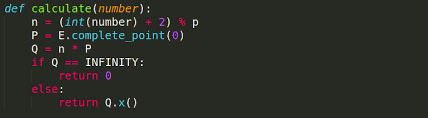

# MatesCTF Round 4 - Learning ECC

Đề bài cho cả source code, thank God. Bài này gồm hai bước.

## Bước 1:

Tác giả cho gợi ý là SVATTT 2017 đều tìm hoài không ra. Mình thì thấy bước 1 giống với bài ECC -Deamon ở SVATTT 2018 ([link](https://gist.github.com/minhtt159/cd53bfef0645fcb67ac87f1e8451a0fe)).

Ở bước này mình nhập vào 1 số **step** và server sẽ trả về giá trị hàm **calculate(step)**.

Nhìn vào đây thì cứ binary search cho **step** để tìm p. Dễ dàng tìm được

> p = 115792089210356248762697446949407573530086143415290314195533631308867097853951

Google p ra được **NIST P-256**. (Thực ra thì NIST P-256 có nhiều cách chọn b, đều check dễ thôi). Tới đây mình tìm được thông tin của curve. Xong bước 1.

## Bước 2

Server chọn một số random q và công bố điểm **point_Q = q*base_point**; client chọn một số p và gửi về **point_C = p * base_point**. **point_shared_secret** được tính bằng **point_C + point_Q**.

Nhiệm vụ của chúng ta là đi tìm s sao cho **point_shared_secret = s * base_point**. Việc này chả khác gì đi giải bài logarit rời rạc. Có một cách dễ hơn là tìm s trước, tính **point_shared_secret** trước và tính **point_C = point_shared_secret - point_Q**.

Request lên server trả về **Qx**, **Qy**. Chọn s = 1 cho **point_shared_secret = base_point**. Vậy là tìm được **Cx**, **Cy**. Submit lên và nhập thêm **s = 1**. Done!

Flag là: `matesctf{Well_you_know_ecc_now!}`
