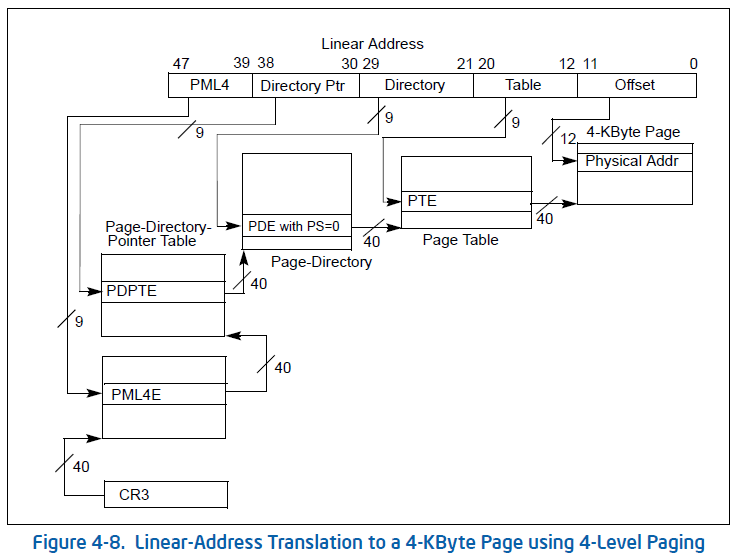

In this post, we revisit the concept of virtual address, learn and practice
translating address from virtual to physical and vise-versa. As a bonus, we
also learn about the Windows' process and how each process has a different DTB. 


# Virtual Address

## The Concept

Memory is limited, for laptops it is often around 8GB to 16GB, for desk
computer it's could be as much as 64GB. No matter how much physical memory is
installed, operating system still use virtual address to isolate process's
space.

When a process is created, it lives in it owns address space. The same address
in two processes point to two different places on the physical memory. The
kernel too has an isolated memory space. Most OSes implement the kernel space
to be visible (not neccessarily accessible) by every process (probably due to
kernel mode switching ???).

Virtual address is possible because the OS does not load every thing on to the
memory. It splits data into pages of either 4KB or 2MB. If the data is
disk-bounded, then when a certain *Read Only* page is used, it will be mapped
onto the physical memory. For a Writable page, it will written out to the disk
at some particular place when unused. If the page is non existed, the OS will
not perform any thing. A process running could have a wide range of address,
though only some pages are accessible, the rest are NULL. An example in Windows
64-bit, a process could have as much as 2TB[1], however only some small pages
scattered accross the 2TB range are valid.

## Directory Table

Each process has its own table to translate the virtual address to physical
address. This table is called directory table base. The pointer to the table is
stored in a process CR3 register. CR3 is often called with another name,
Directory Table Base. Every process, when looking up a virtual address will
have to resolve into physical address using the CR3. If the page is invalid,
read and write action will cause exception to the process. The OS often return
a zero value for read operations and crash the process for invalid write. How
the OS handles depends on its implementation.

We won't go deep into how Directory Table is organized just yet, but here is a
few things to note. The Directory Table is a table of with 512
pointers/addresses. Depends on the type of paging, we could have nested table
until the address in the table points to a physical memory. In orther words,
Directory Table Entry points to another table, and that table entry could point
to another table or a physical address. The last entry, the physical address,
is the physical address of the page after the translation.


# Address Translation

Let's go deeper! How can we really translate a virtual address into its
physical address? How can we know if the page is valid?

## CR4 and multi-level paging

### PAE and Long Mode

In 32-bit system, we usually can't have more than 4GB of user virtual memory
space. PAE (Physical Address Extension) mode can extend this to give more
memory. Long Mode is required to switch from 32-bit to 64-bit (64-bit registers
are available as well as 64-bit specific instructions). When Long Mode is
enabled, PAE must also be enabled.

### Paging Modes

Intel processors (and AMD ones) have 5 different paging modes. Paging Mode
defines how the processor should look for a physical address given a virtual
address. The 5 paging modes are "None", "32-bit", "PAE", "4-level", "5-level".

To know which paging mode is being used, we reference the PAE, Long Mode and
CR4 register value.

| Paging Mode | Paging | PAE | Long Mode | Level-5 |
|-------------|--------|-----|-----------|---------|
| None        | 0      |     |           |         |
| 32-bit      | 1      | 0   |           |         |
| PAE         | 1      | 1   | 0         |         |
| 4-level     | 1      | 1   | 1         | 0       |
| 5-level     | 1      | 1   | 1         | 1       |

> Paging check is bit 31 in CR0, PAE check is bit 5 in CR4, Long Mode is
specified through bit 8th of IA32_EFER, Level-5 check is bit 12 in CR4.

64-bit architectures are Long Mode so either the paging mode is 4-level or
5-level. And because paging is default in today's computer, Paging value is
always 1, thus we only need to check for CR4 values.

### Paging Structures

"None" paging mode is a one-one mapping which requires no additional
translation, however the rest of the paging modes requires translation through
the set of paging structure. Paging structures are tables as we've described
above, with the size of the table is guaranteed to be 4096 bytes. For "32-bit"
paging mode, there are 1024 entries in the table where each entry is 32-bit in
size. For "PAE", "4-level" and "5-level" paging modes, there are 512 entries in
the table where each entry is 64-bit in size.

The paging structures are named and for each paging modes the entries will
point to another paging structures (with exception for the last table where it
points to a physical address). The names for the structures are Page table,
Page Directory, Page-Directory-Pointer table, PML4 table, PML5 table. We often
refer to them using their acronyms: PT, PD, PDPT, PML4, PML5 with their entries
type PTE, PDE, PDPTE, PML4E, PML5E.

## Address Translation

After knowing about the paging modes and paging structures, we will go deeper
into how a virtual address is translated into physical address. Because there
are many paging modes and going them one-by-one will make this post lengthly, I
will only go through 4-Level paging mode as this is used in 64-bit machines as
default. Other paging modes are the same, with the different in which paging
structure is used.

### 4KB Paging

In Figure 1, we can see how the virtual address (linear address) are
segmented into index of each paging structure and eventually points the 4KB
Page at a physical address.



Using bit fields in C structure, we can rewrite the virtual address value using
the structure VirtualAddress.
```c
struct {
  int64_t offset : 12,
  int64_t table : 9,
  int64_t directory : 9,
  int64_t directory_ptr : 9,
  int64_t pml4 : 9,
} VirtualAddress;
```

First of, the CR3 register contains the physical address of PML4 table.

```c
struct {
  int64_t present : 1;
  int64_t reserved : 11;
  int64_t _ptr : 36;
} PML4E;

typedef PML4E[512] PML4;
PML4* cr3;
```

Using pml4 of VirtualAddress we get the PML4E entry that the virtual address
points to. PML4E has a pointer to PDPT, which is the physical address of PDPT.
Using this we get the next table.

```c
PML4E e = (*cr3)[addr.pml4];

assert(e.present == 1) // entry must be present

struct {
  int64_t present : 1;
  int64_t reserved : 6;
  int64_t one_gb_page : 1;
  int64_t ignored : 4;
  int64_t _ptr : 36;
} PDPTE;

typedef PDPTE[512] PDPT;
PDPT* pdpt_ptr = e._ptr;
```

The case when PDPTE's `one_gb_page == 1` will be discussed later, we assumed
`one_gb_page == 0`. Then, `_ptr` contains the physical address of the next
table `Page Directory`.

```c
PDPTE e = (*pdpt_ptr)[addr.directory_ptr];

assert(e.present == 1) // entry must be present
assert(e.one_gb_page == 0) // in this context

struct {
  int64_t present : 1;
  int64_t reserved : 6;
  int64_t two_mb_page : 1;
  int64_t ignored : 4;
  int64_t _ptr : 36;
} PDE;

typedef PDE[512] PDT;
PDT* pdt_ptr = e._ptr;
```

The case when PDE's `two_mb_page == 1` will be discussed later, we assumed
`two_mb_page == 0`. Then `_ptr` contains the physical address of the next table
`Page Table`.

```c
PDE e = (*pdt_ptr)[addr.directory];

assert(e.present == 1) // entry must be present
assert(e.two_mb_page == 0) // in this context

struct {
  int64_t present : 1;
  int64_t reserved : 11;
  int64_t _ptr : 36;
} PTE;

typedef PTE[512] PageTable;
PageTable* pt_ptr = e._ptr;
```

`pt_ptr` contains a series of pointer to 4KB Page on the physical memory. To
get the page that maps with the virtual address, we perform:

```c
PTE e = (*pt_ptr)[addr.table];
int64_t page = e._ptr;
```

When the corresponding page for the virtual address is found, we get the exact
address for the virtual address with the offset.

```c
int64_t physical_address = page + addr.offset;
```

## 2MB Paging

## 1GB Paging


To be updated
