*This is a write-ups for the Efiens's qualification CTF - round 2 and this is my first CTF write-ups ever. Actually, when I participated in this CTF, I was kind of a newbie who had just gotten into programming for 5-6 months and CTF for about 2 months so this write-ups might not be perfect and the solution might be somewhat naive. But I hope I can deliver the general idea of my thought process on each challenge and how to solve them. So, welcome, and let's begin with our first challenge.*

## Pwn: lottery

Source: https://github.com/lkmidas/EfiensCTF_Round2/tree/master/pwn_lottery

This first challenge is pretty simple, it gives us a program that secretly generates 2 random integers, ask for the player's name, print out that name and then ask for a number, if our input number is equal to the sum of the 2 random numbers generated earlier, we get the flag.

Looking at the source code, I realized that there is a `format string` bug because our name input will be taken directly into the format string parameter of `printf`, and also, the 2 numbers are generated before that `printf`, so we can easily exploit the bug to leak out those 2 numbers, take their sum, and input it to get the flag. Debugging with GDB, I saw the 2 numbers were at the position of the 6th and 7th parameters of `printf`, so in order to leak those numbers, my input was as follow: `%6$d %7$d`.

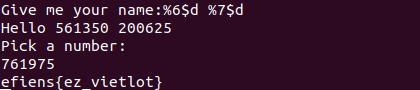

`efiens{ez_vietlot}`

## Pwn: Cuộc đời bạn màu gì?

Source: https://github.com/lkmidas/EfiensCTF_Round2/tree/master/pwn_life

This challenge is also pretty simple, we are given a Python program that will randomly choose one of the 6 colors, ask for your name and then print out that color as the color of your life. There is no flag in the source code this time, so our goal will be getting a shell here.

For the first few minutes, I couldn't spot out the bug here, "How can a program as simple as this has a bug?" - I asked myself. But very soon after that, I looked at the very first line of the code and noticed that this is Python 2, and in Python 2, we seldom take user's input with the `input()` function (it may sound a bit silly but whatever). The function `input()` in Python 2 is not equivalent to that of Python 3, while Python 3's `input()` takes user's input as a string, Python 2's `input()` actually evaluates your input.

With that figured out, I could just use this to execute the system function in the os library with the parameter `/bin/sh` to get a shell. My input was as follow: `__import('os')__.system('/bin/sh')` .

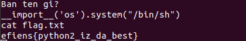

`efiens{python2_iz_da_best}`

## Pwn: heap

Source: https://github.com/lkmidas/EfiensCTF_Round2/tree/master/pwn_heap

Checksec: 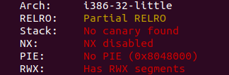

Okay, things start to get interesting as we don't get the source code for this challenge, but we do have an information that ASLR is disabled.

First of all, I ran the program and tried several inputs, the outputs were pretty much the same for all of those: some weird sentences and a bunch of asterisks were printed out. So after that, I tried to open the binary with IDA. I didn't go through all of those instructions because I'm bad, but I did notice some important things: under some conditions, the program will print out "Uh oh! You smashed something" and some DEBUG lines. I then immediately tried to "smash" it with a long input, and yes, those lines got printed out. In addition, those asterisks that were printed out earlier were not here, a part of my input got printed out instead. "A program that prints out your input? This maybe format string again!" - I thought. And yes, it was indeed format string. Next up, I tried to reduce the size of my input to see at which length did it get smashed, and it started to happen at 136-byte-long input, the first character to be printed out is the 137th byte. So I tried to leak the stack out, and what I got was as follow:

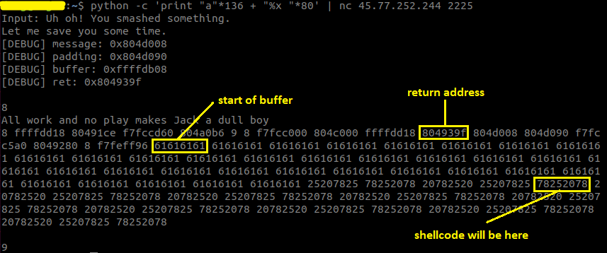

Looking at the output for a while, I realized that with the address of the buffer given by the debug lines, I could calculate the address where the return address lies. And also, this program doesn't have NX, so I could inject a shellcode in my input and execute it on the stack, its address can also be calculated based on the address of the buffer. I had all the required information then, with the format string bug, I could overwrite the return address with the address of the shellcode, and by that, I could get a shell (the addresses on the stack are pretty large so I had to overwrite the return address one byte by one byte separately).

Exploit code: https://github.com/lkmidas/EfiensCTF_Round2/blob/master/pwn_heap/heapexploit.py

`efiens{the_art_of_formatstring}`

## Pwn: calculator

Source: https://github.com/lkmidas/EfiensCTF_Round2/tree/master/pwn_calculator

Checksec:

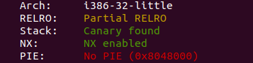

This program has 3 options: write up to 16 numbers into the calculator at the chosen index, read a number at the chosen index, take the sum of those and exit. I actually had never solved a challenge with ASLR before this so I had to ask the author of this challenge **@pickaxe** for some technical stuff, and with those knowledge, I managed to solve it.

Again, there is no flag or get flag function in the source, so our goal to get a shell. Moreover, the program has NX, so we can no longer execute a shellcode on the stack like in the previous challenge. Therefore, we need to do some `ret2libc` action.

First of all, I saw that the program restricts the upper bound of the index can be chosen to write into, but it doesn't restrict the lower bound! So, we can have negative index input and that will actually overwrite something on the stack. Open the program with GDB and debug it, I quickly noticed that the return address of the `dowork` function is located at index number -8, so it is fully under our control (overwriting the return address doesn't even touch the stack canary which is extremely convenient for us). 

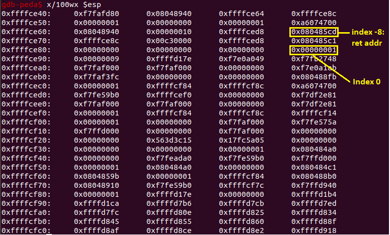

The system has ASLR, so I had to leak the base of libc first. I did it by overwriting the return address and 2 next memory slots as follow: `puts@PLT | puts ret addr | puts@GOT` (I chose the start of main for the ret addr just to be sure nothing weird happens). Parsing the first 4 bytes and substracting it with the puts offset, I had the base of `libc`. With it, I could easily calculate the addresses of `system` and `/bin/sh`. Now with all the information, I went back to the overwriting process again and set it up as follow: `system addr | 4 random bytes | /bin/sh addr` . And that should give me the shell, right?...

...

Wrong!!! No shell for me! I struggled for quite a while trying to figure out what was the problem here. Even though my solution seemed very logical, it didn't go the way I wanted. Later, I figured out that the problem here was that the input was taken as `long`, which has the upper bound of  2^31 -  1, which is much smaller than the addresses on `libc`, so I couldn't directly input it that way. With the problem figured out, the solution was pretty simple: just take the correspondent negative value of the addresses by substracting it with 2^32. And finally, the shell was mine.

Exploit code: https://github.com/lkmidas/EfiensCTF_Round2/blob/master/pwn_calculator/exploit.py

`efiens{ret2libc_is_sooo_fun}`

## Pwn: PhoneBook

Source: https://github.com/lkmidas/EfiensCTF_Round2/tree/master/pwn_PhoneBook

Checksec: 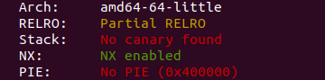

Another challenge that I required some hint to solve. The author's hints were: "overwriting GOT" and "the do you want to quit prompt".

This program has 4 options: adding a contact, viewing one, deleting one and quit. There is a getFlag function in the source, so our goal is to find a way to call it.

First of all, before the second hint was given, I had already realized that when the phonebook is full, the index checking doesn't stop, and because the choice input's buffer is 16 bytes long, if I set the third 4 bytes of it to 0, the program will treat it as a new index and I could overwrite the handler function's frame pointer (but of course, I didn't know what to do with it at the time because I could't think of a way to overwrite GOT when I only had control over the frame pointer). 

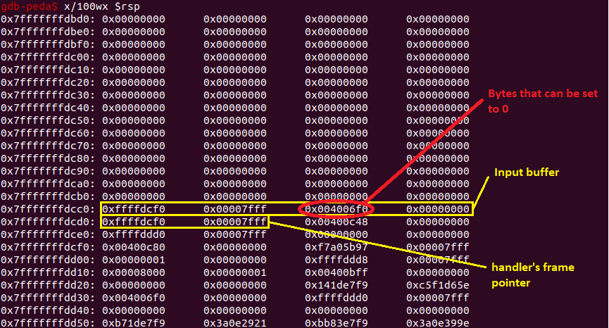

With the latter hint revealed, I started to look at `main` (because the prompt happens in `main`). Reading the instruction, I realized that the first parameter of `readString` - which is the address of the buffer - is taken as `rbp - 0x10`, and that value is modifiable. After handler returns to `main`, its frame pointer is popped, so then I could set the rbp in main to anywhere I want. After prompting for input, `strcmp` got called, so if I could overwrite the address at `strcmp@GOT` to getFlag's address, it will be called instead. Overwriting `GOT` became much more simple now, the only thing I needed to do was set the handler's frame pointer to `strcmp@GOT + 0x10` and input the prompt with `getFlag` address. And with that, I got the flag.

Exploit code: https://github.com/lkmidas/EfiensCTF_Round2/blob/master/pwn_PhoneBook/exploit.py

`efiens{master_of_stack_based_exploit}`

*Note: The quitting prompt interaction is pretty weird because "y" means stay and any other characters mean quit. However, this was pretty much intended by the author because otherwise you can make another index and overwrite the return address itself.*

## RE: xor

Binary: https://github.com/lkmidas/EfiensCTF_Round2/tree/master/RE_xor

We continue to our first Reverse Engineering challenge. In this challenge, we are given a program that take a key as the input, does something with it (maybe does some xor operator as the name suggests) and if our key is correct, we get the flag.

The solution is extremely simple though. First, I opened the binary with IDA and then I saw a string that looks like the key: M3A8S174, so I tried to run the program and input that string as the key. And that really was the key so I got the flag (I didn't even bother looking at the rest of the binary tbh that's why I am not sure what it does lol) .

`efiens{x0r_s0_fun^^}`

## RE: tricky

Binary: https://github.com/lkmidas/EfiensCTF_Round2/tree/master/RE_tricky

This challenge is a pretty nice one. The program asks us for a password, and if our password is correct, we will get the first half of the flag. It then asks us for the second password and rewards us with the second half if we get it right. The program also has an anti-debug mechanic (but bypassing it was pretty easy though [1]).

First of all, I opened the binary with IDA and looked at the algorithm that checks the first password. It was pretty simple. First, `(strlen(s) & 3)` **must not be 1** so that means the last two bits of the password's length must be 0, in other words, the password's length must be divisible by 4. Next, the password must not contains any character that has the restricted ASCII value. The final condition was pretty hard to understand for me at first, but after bypassing the anti-debug and debugged it, I realized that what it does is just splitting your password into blocks of 4 bytes, taking the sum of them and then comparing it with... -1??? This is the first tricky part, because it was not compared with `-1` at all, it was with `0xffffffff` (I think that was because IDA pseudocode reads that as -1 since that value is more likely to be `-1` so it kinda messed up there). With all those conditions, I wrote a short Python script that generate a password that satisfies them all, which I got `AAAAAAAA}}}}`.

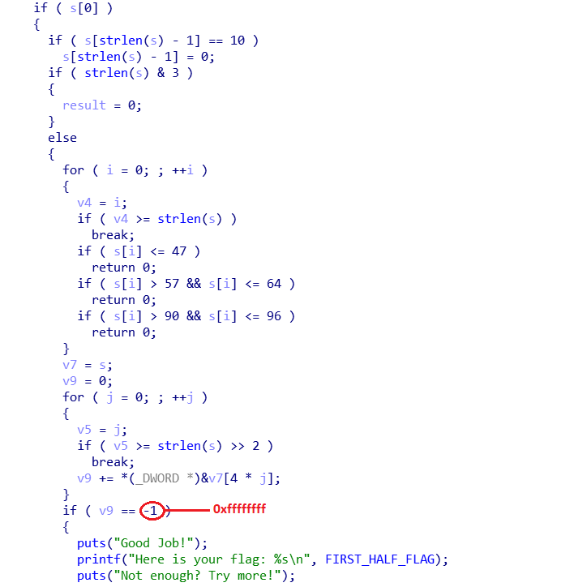

The next half was where it seemed to be tricky because there was some Virtual Machine action going on. But before that, our password must satisfy some conditions first. Again, `(strlen(s) & 3 != 1)`, that means the length must be divisible by 4. Then,  `(strlen(s) - 12 > 3 != 1)`, another tricky part, my first conclusion was that the length can only be 4, 8 or 12, but when debugging, the length of 4 and 8 didn't seem to work. I then realized that it was because strlen returns an `unsigned int`, so when strlen(s) - 12 equals to a negative value, it actually gets rolled up to a very large value and that value for sure greater than 3, so only the length of 12 works. Next, I tried to read through the VM part but couldn't understand most of them, so I tried to run the binary and input a random length-12 password and see what happens. And how convenient! It printed out all the opcodes it used and all I did was to follow them one by one (they were really simple) and I got the second password: `14ae5ee7a285`. With those 2 passwords in hand, I got the flag.

Script: https://github.com/lkmidas/EfiensCTF_Round2/blob/master/RE_tricky/trickysolve.py

`efiens{th15_15_A_veRy_3a5y_VM}`

## RE: SMT

Binary: https://github.com/lkmidas/EfiensCTF_Round2/tree/master/RE_SMT

As challenge's description says, this is an introduction to SMT. At first, I didn't know what SMT is but this is a RE challenge so I just proceeded to open it in IDA anyway, and what I got was a mess with a bunch of variables and formulars. It was very intimidating! But then after some googling and research, I found out that this challenge is more intimidating than it is hard.

There is a pretty funny part about this challenge is that if you run the binary, you will get nothing but an infinite loop that will keep printing out dots. But running the binary isn't necessary at all, because the only thing you need to do is solving those formulars and you already get the flag.

Reading the IDA pseudocode, I realized that our input needs to be of length 168, then the formulars are just a bunch of logical operators that operate on every single bytes of our input. After some researchs, I learned that SMT problems can be solved with z3 solver [2], so all I did was copy all of the formulars from IDA pseudocode to my python script, used some regex to modify them and after that ran the code to get the flag (I don't know if there are any other ways to quickly transfer those formulars into python but this works so I will just go with it for this specific challenge).

Script: https://github.com/lkmidas/EfiensCTF_Round2/blob/master/RE_SMT/SMTsolve.py

`efiens{Do_you_know_SMT_Solver_is_computer_science_wet_dream?}`

## RE: hidden

Binary: https://github.com/lkmidas/EfiensCTF_Round2/tree/master/RE_hidden

This is our final RE challenge, and it is very very interesting. As the title suggests, this challenge's flag is hidden extremely well, and I don't think I could ever solve this challenge without some hint from its author @ks75vl.

The challenge provided us with a PE file. But the weird thing about it is that when I opened it, I got a dll missing error. I checked my system32 and saw that the dll was there, so what happened? I proceeded to ask the author about it and he gave me the first hint: "debug and try to understand the part where it loads the libraries"

After quite some time debugging, I understood what the load library function does: it first loads user32.dll, then calls the user32_MessageBoxA to print out the error, so the error was fake after all, and then it frees the library and exits the program, that's why nothing happened after the error. My first try was to use a hex editor to NOP out the exit call but then all I got was a blank flag: efiens{}.

I then asked for the next hint and it was "the flag is near there, somewhere in the unused data". So I took a look at the function again and saw that all the data must go through another function before they are used. Luckily for me, that function was not hard to understand: it takes an array of integers as parameter then does the not operator on all of the elements and then deletes the first element. So I tried to perform that on all of the unks in the data segment and the very last of them gave me the flag.

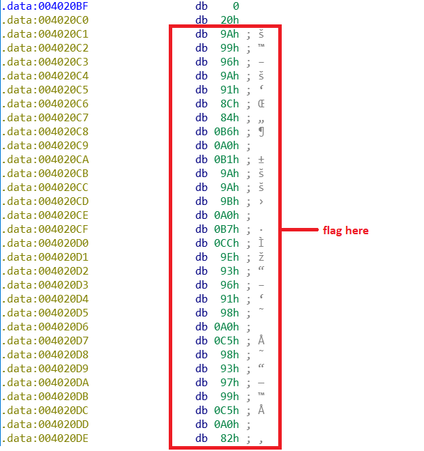

`efiens{I_Need_H3aling_:glhf:_}`

## Web: echo

Source: https://github.com/lkmidas/EfiensCTF_Round2/blob/master/web_echo/index.php

Next up are the web challenges, starting with a php challenge. The web takes in one GET parameter 'echo', and if our input satisfies some conditions, it will be eval and echo out. Those conditions are: it must not contain php's internal functions, some more functions and some special characters, so we are pretty much limited to using the user-defined function `f10eq()` which is a pretty useful one that scans the current directory.

First, I tried to do just that with `echo=f10eq()` and got an error because scandir returns an array while php cannot print out an array. Therefore, I had to look at the files by indexing. However, square brackets are restricted, but it doesn't matter much because this is php and I could use curly brackets instead. At index number 2, I found a file `flag_a3e08ffc1c35e624cc38da823ee254cb.txt`, I then opened it and I got the flag.

`efiens{H3roes_Nev3r_Die!_^^}`

## Web: Avatar

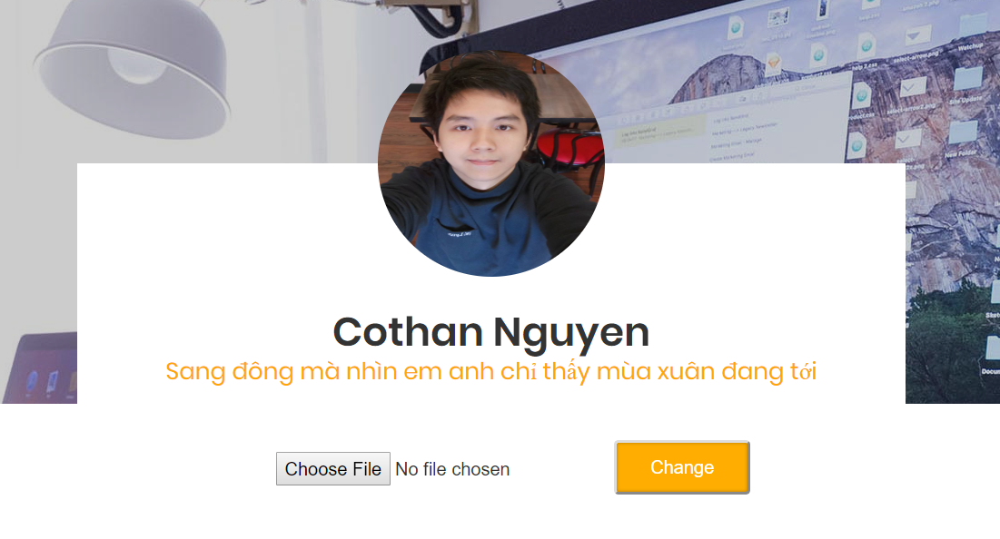

This web allows you to upload an image file to change the user's avatar.

First of all, I tried to upload something that was not an image file and the web accepted it, it didn't restrict anything. Therefore, I could upload a php file and open it. But the thing is I didn't know where the uploaded file was at, and the hint was that it was somewhere on the server, so `dirsearch` [3] came into play. Scanning the web server revealed a folder named uploader that seemed to be where the files were at.

The first file I uploaded contains the code `<?php passthru("ls -a ..") ?>` to list all files in the parent directory of `uploader`, and I found a directory named `e6e677e0c080e30506687ef22b7d5f20` (at first I thought this was a file and tried to read it lol). Uploading another file to list all files in that directory, I found the flag.txt file. I then uploaded another file contains `<?php passthru("cat ../e6e677e0c080e30506687ef22b7d5f20/flag.txt")?>` and I got the flag.

`efiens{whY_d0nT_U_upL0aD_4n_1mag3_file????}`

## Web: Avatar v2

*Note: According to the author, the source code of the challenge was buggy at first so I will skip the part when I was trying to solve the buggy version.*

This challenge seems identical to the previous one, but now, your uploaded files are restricted to only image files.

I didn't know what kind of restriction the web used, so I just tried all the different methods to bypass it. One of them was changing the first 4 bytes (aka the magic bytes) of the file to GIF8 to trick the server. This trick worked, so nothing more to say. All I did was exactly the same as the previous challenge with GIF8 at the start of each files and I got the flag.

`efiens{whY_d0nT_U_upL0aD_4n_1mag3_file?v?2??}`

## Web: fashe

Source: https://github.com/lkmidas/EfiensCTF_Round2/blob/master/web_fashe/index.html

Hint: "SQL Injection", "not related to crypto".

This is a pretty cool web challenge. Our goal here is to buy all the 3 products  and we will get the flag. We only have 50$ while the products are 30$, 60$, 60$ so we must apply some coupon to reduce their prices.

Reading the source code, I saw that the coupon for the 2nd product is already in there, so our goal here is to find the 3rd product's coupon. After some tries and error, I found out that there was a query error in the productID input field, so that will be where SQL Injection happens. And looking closely at the source code, I noticed that it only takes out the last character of the productID as the ID, so if I input the productID as `" OR "3"="3 `and the coupon as the 2nd product's coupon, the 3rd price should be reduced. And yes it worked, but the thing is, the key to decrypt the flag is all the coupon combined, if I did it this way, the 3rd coupon was incorrect, so that even though I had bought all 3, there was no flag to be found.

Therefore, I tried Blind SQL injection to find the 3rd coupon. What I did was to input the productID as `" OR BINARY CODE LIKE "%x% `where x is a character from `a-z, A-Z, 0-9` to find all the possible characters in the coupon (if I get a "recheck your code" warning, that means the character is correct, it is incorrect otherwise). After that, I did it again with` " OR BINARY CODE LIKE "x%` and tried with all the possible x discovered before, if a character is correct, I moved onto the next one consecutively (I didn't know how to write a script to do it automatically so I did it manually which was pretty time-consuming, but that worked anyway). The coupon was `hAApY_A97jM_9MpGt` .

This is the exploit script that I wrote several days after with some help: https://github.com/lkmidas/EfiensCTF_Round2/blob/master/web_fashe/exploit.py

`efiens{n1c3_tRY_0n_bL1nD_SQLi___h4ppY_n3W_y34R__!}`

## Web: Admin vs Dog

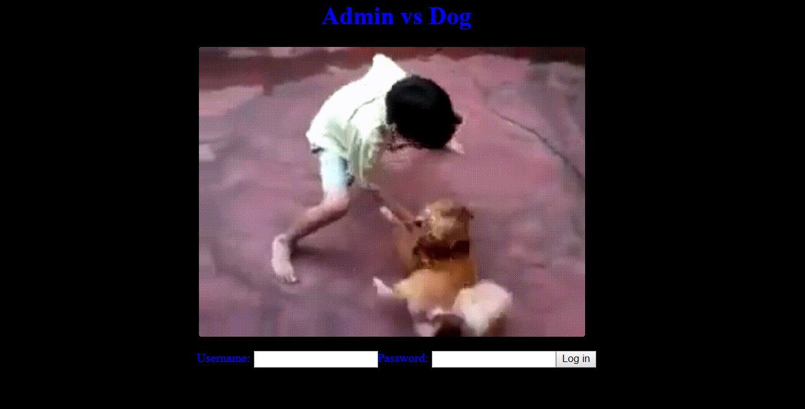

Hint: "doghunter", "symbolic link"

The challenge starts with a login screen with a GIF of some dude vs a dog.

The login part was kinda weird, I didn't fully understand how it worked and if what I did was the right way, but the first hint revealed was "doghunter", so I tried to login with username and password as "doghunter" and it did log me in.

Next up, it showed that the flag was in /etc/flag, and we are allowed to upload a zip file, and then, the zip file's content will be shown on the screen. I tried uploading various files (txt, php, JS, ...) and didn't get anything useful. Then I tried googling to see if there are any vulnerabilities in uploading a zip file, and there is: the **Zip Slip** [4]. I did some research, and I found the symbolic link **Zip Slip**. So what I did was as follow: opened Terminal and typed the following commands:

- `ln -s /etc/flag ./symlink.txt  `
- `zip —symlinks -r submit.zip ./symlink.txt`

And then I submitted the zip file and got the flag.

`efiens{D0nT_f3Ar_Th3_D0G}`

## Crypto: 46esaB

Given file: https://github.com/lkmidas/EfiensCTF_Round2/blob/master/crypto_46esaB/S0meTh1ng.txt

Next up, we have some cryptography challenges. First of all, I have to say that this is not my strong part and I'm not that good at math, so most of these solutions are just 20% math, 30% help from others and 50% google. But I did solve them anyway so I just want to write something about them.

With that said, we begin with our first challenge. This challenge is maybe the only one that I solved myself without any hints because it was quite easy. All we are given was a file names `S0meTh1ng.txt` .

Looking at the file's content and the title of the challenge (which is base64 backwards), I recognized this was base64 encoded, so I tried to decode it, but decoding it once or twice just gave me some more base64 encoded text. Therefore, I simply used a loop to decode it multiple times until it has the form of a flag.

Script: https://github.com/lkmidas/EfiensCTF_Round2/blob/master/crypto_46esaB/46esaBsolve.py

`efiens{196}`

## Crypto: RSA Return

Given file: https://github.com/lkmidas/EfiensCTF_Round2/blob/master/crypto_RSAreturn/RSA.txt

Hint: Wiener attack.

Looking at the given file, I could see that this is a RSA encryption with a very large e value, so I didn't know what to do at first. But then the hint came, and things became much much easier. I did some googling and found a lot of Wiener attack script, but I ended up choosing this sage script [5] because I thought it was the simplest one. All I did was to modify it a little bit and I'm done.

Script: https://github.com/lkmidas/EfiensCTF_Round2/blob/master/crypto_RSAreturn/RSAreturnsolve.sage

`efiens{2_plUs_2_1s_4_m1nUs_1_th4t_3_qu1ck_m4th}`

## Crypto: Seem Easy

Given files: https://github.com/lkmidas/EfiensCTF_Round2/tree/master/crypto_SeemEasy

Hint: modular sqrt

This challenge is the one that I did NOT solved it myself. This whole solution was of my friend @Daru-kun (I did give him some ideas that led to the solution though). He solved this one and showed me the solution, and all I did was to re-implement it in sage for simplicity.

We are given a python file named wtf that looks like an encryption file and a log file. Reading the python file closely, we can see that this is again a RSA encryption on `flag^2`, with the private key and cipher saved in the log file, and t being the product of 2 primes. So what he did was to decrypt the RSA, use Tonelli-Shank to calculate the modular sqrt and then use CRT to retrieve the flag. I then re-implemented it in sage so that I could use the built-in modular sqrt and CRT functions without implementing them.

Script: https://github.com/lkmidas/EfiensCTF_Round2/blob/master/crypto_SeemEasy/seemeasy_solve.sage

`efiens{RSA_shared_bit_never_get_old!_Now_you_have_known_RNG_is_very_complicated_to_make_it_right}`

## Crypto: NTRU

Given files: https://github.com/lkmidas/EfiensCTF_Round2/blob/master/crypto_NTRU/NTRU.zip

Hint: LLL Reduction algorithm.

This challenge for me was just pure Google. I first tried to read some documents about NTRU and didn't understand any of them (again my math is not that great). So all I did was to try googling the keyword "**NTRU LLL attack**" and I found this write-ups [6] which has the whole solution script for this exact type of attack (later on, I was told that LLL is just an algorithm, not an attack, the attack itself was LLL-based). Therefore, even though this challenge was considered hard, it was just free for me.

Script: https://github.com/lkmidas/EfiensCTF_Round2/blob/master/crypto_NTRU/solve.sage

`efiens{._.B3y0unD_G0dL1k3._.}`

## Misc: Spammmmm 

Given file: https://github.com/lkmidas/EfiensCTF_Round2/blob/master/misc_Spammmmm/Spammmmm.txt

We have come to our very last challenge. I didn't intend to write about this one because it is just kinda silly, but I also think that it is pretty hilarious so I will just write some lines about it.

We are given a file that looks like a spam email with a pretty nonsense content. There are no hints for this whatsoever and it is also in the misc category so there are absolutely no clues for this one.

With a challenge like this, I though that Google may help, so I tried googling some unique keywords in the text, which was `"Senate bill 2716 ; Title 2 , Section 304"` and I found this site [7]. Turned out that this was just some kind of weird encoding, so I just copied and pasted it into the site and let it decode the text. Salute to the author for this "creative" challenge though.

`efiens{__de_xam_VKL__}`

## References

[1] https://gist.github.com/poxyran/71a993d292eee10e95b4ff87066ea8f2

[2] https://0xeb.net/category/reverse-engineering/z3/

[3] https://github.com/maurosoria/dirsearch

[4] https://snyk.io/research/zip-slip-vulnerability

[5] https://github.com/pwang00/RSA-Attacks/blob/master/wiener.sage

[6] http://mslc.ctf.su/wp/volgactf-quals-2015-cpkc-crypto-400-writeup/

[7] http://www.spammimic.com/decode.shtml
